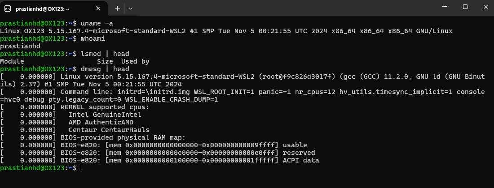
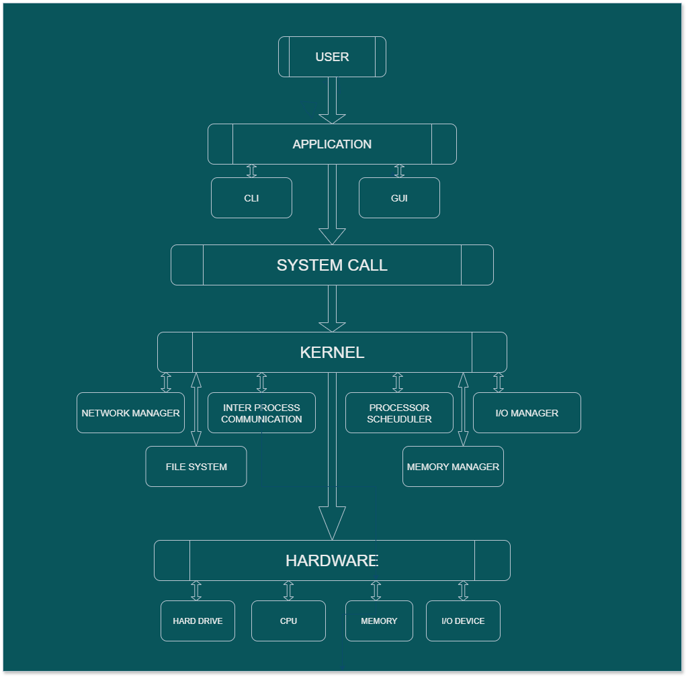

# Laporan Praktikum Minggu 1

### Topik : Arsitektur Sistem Operasi dan Kernel

-----

## Identitas

  - **Nama** : Prastian Hidayat
  - **NIM** : 250202982
  - **Kelas** : 1IKRB2

-----

## Tujuan
1. Mahasiswa mampu mengoperasikan Github, Visual Code Studio, dan Linux dari Ubuntu/WSL.
1. Mahasiswa mampu memahami hubungan arsitektur sistem operasi mulai dari User → System Call → Kernel → Hardware.
2. Mahasiswa mampu menjelaskan fungsi arsitektur utama sistem operasi.
   
-----

## Dasar Teori

  * Sistem operasi adalah perangkat lunak yang mengelola semua perangkat keras komputer yang kompleks. Arsitektur OS modern mengabstraksikan perangkat keras, mengubahnya menjadi sumber daya yang rapi dan mudah dikelola. OS mengelola sumber daya ini, seperti CPU, memori, dan perangkat I/O, serta menyediakan panggilan sistem untuk layanan. Komponen-komponen utamanya meliputi proses, manajemen memori (termasuk memori virtual), sistem file, dan I/O. Arsitektur dapat berupa monolitik, berlapis, atau mikrokernel.

-----

## Langkah Praktikum

1. Mempelajari materi minggu 1 tentang arsitektur sistem operasi.
2. Mengunduh [Git](https://git-scm.com/downloads) dan [Visual Code Studio](https://code.visualstudio.com/download) serta menginstall Linux  dengan melakukan perintah `wsl --install` di Windows Powershell
3. Menyiapkan akun github dan melakukan `fork` dengan menambahkan `os-202501-<NIM>`.
4. Melakukan konfigurasi Git dengan perintah :
   ```bash
   git config --global user.name "username_github"
   git config --global user.email "emailgithub@gmail.com"

   // Untuk memeriksa apakah konfigurasi berhasil
   git config --list
   ```
5.  Salin repositori dari GitHub ke komputer lokal dengan perintah. 
    * Ganti username dan NIM sesuai dengan akun masing-masing.
    ```
    git clone "https://github.com/username/os-202501-NIM.git"
    ```
6.  Sebelum memulai, pastikan sistem Linux (WSL) Anda dalam kondisi terbaru untuk menjaga stabilitas dan keamanan dengan melakukan perintah :
      ```bash
    sudo apt update -y
    sudo apt upgrade -y
    ```
7.  Menjalankan perintah dasar di terminal Linux , yaitu `uname -a`, `whoami`, `lsmod | head`, dan `dmesg | head`. 

8.  Salin dah tempel ke folder `praktikum/week1-intro-arsitektur-os/code/` untuk hasil perintah dasar linux serta screenshots hasilnya dan simpan ke folder `praktikum/week1-intro-arsitektur-os/screenshots/`.
9.  Membuat diagram arsitektur yang menggambarkan alur interaksi dari *User → Application → System Call → Kernel → Hardware* menggunakan draw.io atau sejenisnya dan menyimpannya sebagai `diagram-os.png`.
10. Menuliskan hasil analisis sebagai laporan dari hasil praktikum minggu 1  di `praktikum/week1-intro-arsitektur-os/laporan.md`.
11. Menambahkan screenshot hasil diagram dan experiment linux  ke dalam folder `praktikum/week1-intro-arsitektur-os/screenshots/`.
12. Melakukan *commit* dan *push* seluruh hasil pekerjaan ke repositori GitHub dengan cara :
  
    ```
    // Menambahkan semua perubahan untuk di commit
    git add .

    // Membuat catatan commit dengan pesan dari format yang telah di atur
    git commit -m "Minggu 1 - Arsitektur Sistem Operasi dan Kernel"

    // Push hasil commit ke repositori GitHub
    git push origin main
    ```

-----

## Kode / Perintah

```bash
sudo apt update 
sudo apt upgrade -y
```

```bash
uname -a
```
```bash
whoami
```
```bash
lsmod | head
```
```bash
dmesg | head
```

-----

## Hasil Eksekusi 

---


-----

## Analisis


### 1. Analisis Perintah

- **`uname -a`**
Perintah ini mengidentifikasi **kernel Linux** yang digunakan. Menunjukkan bahwa kernel yang digunakan adalah versi Linux 5.15.167.4-microsoft-standard-WSL2, mengonfirmasi penggunaan WSL 2.

- **`whoami`**
Perintah ini menampilkan **nama pengguna aktif**, yaitu **`prastianhd`**. 

- **`lsmod | head`**
Perintah ini menunjukkan **modul-modul kernel** yang sedang dimuat. Ini adalah bukti dari **arsitektur modular kernel Linux**, di mana driver perangkat dan fitur tambahan dapat ditambahkan atau dihapus secara dinamis tanpa perlu me-reboot sistem.

- **`dmesg | head`**
Perintah ini menampilkan **pesan-pesan dari kernel ring buffer**, yang merupakan log **proses booting**. Outputnya mencakup informasi tentang **deteksi *hardware***, seperti CPU (Intel dan AMD), dan memori. Ini memberikan bukti langsung bahwa kernel berhasil mengenali dan berinteraksi dengan komponen fisik atau virtual dari komputer.

### 2. Analisis Arsitektur OS

* Arsitektur sistem operasi modern didasarkan pada pemisahan antara **mode kernel** yang memiliki hak istimewa dan **mode pengguna** yang terbatas. **Kernel** sebagai inti OS, berjalan dalam mode kernel untuk mengelola perangkat keras secara aman dan menyediakan abstraksi seperti file dan proses untuk program aplikasi. 
* Program aplikasi yang berjalan dalam mode pengguna tidak dapat mengakses perangkat keras secara langsung, mereka harus menggunakan antarmuka **system call** untuk meminta layanan dari kernel. 
* System call inilah yang menjembatani kedua mode tersebut, memungkinkan aplikasi meminta fungsi kernel dieksekusi secara terkendali.

### 3. Analisis Lingkungan Linux VS Windows
* Linux memiliki antarmuka baris perintah (CLI) yang kuat seperti shell. CLI mengutamakan efisiensi, kekuatan, dan fleksibilitas, memungkinkan pengguna untuk menggabungkan perintah-perintah sederhana untuk menyelesaikan tugas-tugas rumit. Di dalam linux semua berisi code atau perintah yang sangat berbeda dengan interaksi di windows

* Windows memiliki antarmuka pengguna grafis (GUI) ramah pengguna bagi semua kalangan. GUI Windows berorientasi pada visual dan system call  yang membuatnya lebih mudah diakses oleh pemula. Interaksi di Windows mudah karena kita interaksi langsung dengan ikon dan jendela, cukup klik dan eksekusi.
-----

## Kesimpulan

Dari praktikum ini, dapat ditarik beberapa kesimpulan:

1.  Perintah baris seperti `uname`, `lsmod`, dan `dmesg` adalah alat yang sangat berguna untuk menginspeksi dan memahami komponen kernel serta interaksinya dengan perangkat keras dari sisi pengguna.
2.  Setiap interaksi antara aplikasi pengguna dan perangkat keras selalu dimediasi oleh kernel melalui mekanisme *system call*, yang merupakan fondasi untuk keamanan dan stabilitas sistem operasi.
3.  Interaksi di windows juga memiliki hubungan dari *user , system call, kernel dan hardware*, tetapi di windows seperti sudah di bungkus dan lebih mudah dipahami serta lebih cepat dalam hal eksekusi atau interaksi karena menggunakan GUI bukan CLI.

-----

## Quiz

1.  **Sebutkan tiga fungsi utama sistem operasi.**
   
    **Jawaban:**

    * Manajemen sumber daya (CPU, memori, penyimpanan, I/O)
    * Menyediakan antarmuka bagi pengguna
    * Menjalankan aplikasi dan program
    * Manajemen file

2.  **Jelaskan perbedaan antara *kernel mode* dan *user mode*.**

    **Jawaban:**
    * Dalam *kernel mode*, sistem operasi berinteraksi dan memberi perintah secara langsung dengan perangkat keras dan mengeksekusi permintaan System Call dari aplikasi. Dalam *user mode*, sebuah program harus membuat permintaan akses khusus ke kernel, yang dikenal sebagai System Call.

3.  **Sebutkan contoh OS dengan arsitektur monolithic dan microkernel.**
    
    **Jawaban:**

    * Contoh OS Monolithic : Linux, FreeBSD, Windows 98
    * Contoh OS Microkernel : QNX, MINIX 3, L4.

-----

## Refleksi Diri

  - **Apa bagian yang paling menantang minggu ini?**
  
    * Ada banyak yang perlu di pelajari di minggu ini, bukan hanya tentang materi arsitektur OS 
    tetapi saya harus mempelajari hal basic secara sendiri seperti 
    menggunakan github, git, visual code studio, 
    cara menulis atau format penulisan dalam dokumen markdown 
    di tambah lagi mencoba 2 OS (Linux dan Windows) secara bersamaan.

  - **Bagaimana cara Anda mengatasinya?**
    * Belajar bersama dengan yang lain, tetapi masih saja belum sepenuhnya paham 
    karena memang banyak yang perlu saya pahami.
    

-----

**Credit:** *Template laporan praktikum Sistem Operasi (SO-202501) – Universitas Putra Bangsa*