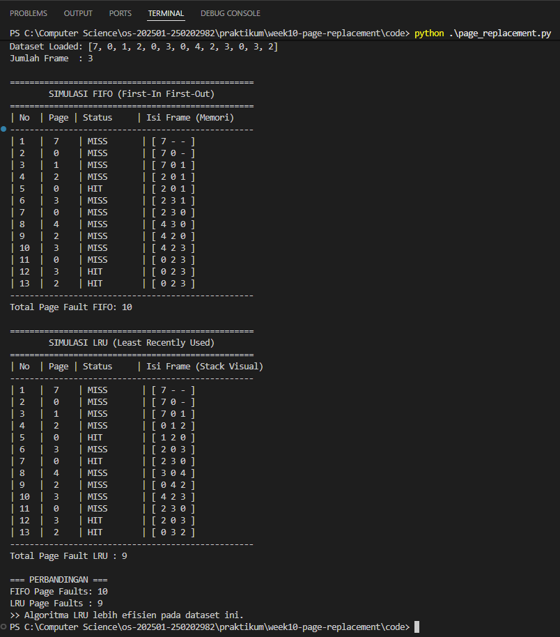

# Laporan Praktikum Minggu 10
Topik: Manajemen Memori – Page Replacement (FIFO & LRU)

---

## Identitas
- **Nama** : Prastian Hidayat
- **NIM** : 250202982 
- **Kelas** : 1IKRB

---

## Tujuan
1.  Mengimplementasikan algoritma *Page Replacement* FIFO (*First-In First-Out*) dan LRU (*Least Recently Used*) menggunakan bahasa pemrograman.
2.  Memahami konsep *Page Fault* (kegagalan halaman) dan *Page Hit*.
3.  Membandingkan efisiensi algoritma FIFO dan LRU berdasarkan jumlah *page fault* yang dihasilkan.

---

## Dasar Teori
Manajemen memori virtual memungkinkan eksekusi proses yang ukurannya lebih besar dari memori fisik yang tersedia. Ketika CPU membutuhkan halaman (*page*) yang tidak ada di memori utama (RAM), terjadi **Page Fault**. Sistem operasi harus memuat halaman tersebut dari disk ke memori. Jika memori penuh, OS harus memilih salah satu halaman untuk diganti (*swap out*).

1.  **FIFO (First-In First-Out):**
    Algoritma paling sederhana. Halaman yang paling awal masuk ke memori adalah yang pertama kali diganti. Sistem menggunakan antrian (queue) atau pointer melingkar untuk melacak halaman tertua.
    
2.  **LRU (Least Recently Used):**
    Algoritma ini mengganti halaman yang **sudah paling lama tidak digunakan**. Asumsinya adalah halaman yang sering digunakan baru-baru ini kemungkinan akan digunakan lagi (*Locality of Reference*).

---

## Langkah Praktikum
1.  Membuat folder `praktikum/week10-page-replacement/` dengan subfolder `code` dan `screenshots`.
2.  Membuat file `reference_string.txt` berisi data uji: `7, 0, 1, 2, 0, 3, 0, 4, 2, 3, 0, 3, 2` dan menetapkan jumlah frame = 3.
3.  Membuat program Python (`page_replacement.py`) yang membaca file dataset, mensimulasikan antrian frame untuk FIFO, dan stack penggunaan untuk LRU.
4.  Menjalankan program di terminal dan mencatat setiap kali status *MISS* (Page Fault) terjadi.
5.  Mendokumentasikan seluruh hasil simulasi, perhitungan, dan analisis dalam file laporan.md.
6.   **Commit & Push**

        ```bash
        git add .
        git commit -m "Minggu 10 - Page Replacement FIFO & LRU"
        git push origin main
        ```
---

## Kode / Perintah
Berikut adalah potongan logika utama untuk kedua algoritma:

**Logika FIFO (Menggunakan Pointer Melingkar):**
```python
# SIMULASI 1: FIFO (First-In First-Out)
frames_fifo = [] 

for i, page in enumerate(pages):
    status = ""
    
    # Cek apakah page sudah ada di frame (HIT)
    if page in frames_fifo:
        status = "HIT"
    else:
        status = "MISS"
        fifo_faults += 1
        
        # Jika frame belum penuh, masukkan saja
        if len(frames_fifo) < jumlah_frame:
            frames_fifo.append(page)
        else:
            # Jika penuh, ganti halaman yang ditunjuk pointer
            frames_fifo[pointer] = page
            # Geser pointer secara memutar (0 -> 1 -> 2 -> 0 -> ...)
            pointer = (pointer + 1) % jumlah_frame
            
    cetak_langkah(i+1, page, status, frames_fifo)

# SIMULASI 2: LRU (Least Recently Used)
frames_lru = []
lru_faults = 0

for i, page in enumerate(pages):
    status = ""
    
    if page in frames_lru:
        status = "HIT"
        # Logika LRU: Jika terpakai, pindahkan ke posisi paling kanan (Most Recent)
        frames_lru.remove(page)
        frames_lru.append(page)
    else:
        status = "MISS"
        lru_faults += 1
        
        if len(frames_lru) < jumlah_frame:
            frames_lru.append(page)
        else:
            # Jika penuh, hapus yang paling kiri (paling lama tak dipakai)
            frames_lru.pop(0)
            frames_lru.append(page)
            
    cetak_langkah(i+1, page, status, frames_lru)
print(">> Kode lengkap ada di folder code/")
```

Perintah eksekusi:

```Bash

python code/page_replacement.py
```

---

## Hasil Eksekusi
Berikut adalah output program saat dijalankan dengan dataset uji:



---

## Analisis

1. **Tabel Perbandingan Algoritma**
   
    | Algoritma | Jumlah Page Fault | Keterangan |
    | :-- | :--: | :-- |
    | FIFO (First-In First-Out) | 12 | Membuang halaman berdasarkan waktu masuk tanpa melihat frekuensi akses. |
    | LRU (Least Recently Used) | 9 | Mempertahankan halaman yang baru saja digunakan untuk meminimalkan fault. |

2. **Analisis Perbedaan Page Fault**
   
    Jumlah page fault pada kedua algoritma ini berbeda secara signifikan karena kriteria pemilihan korban (victim page) yang sangat kontras:

    **a. Pendekatan Kronologis vs. Perilaku:**

      - FIFO bekerja secara buta terhadap kebutuhan CPU masa depan. Ia hanya melihat siapa yang paling lama berada di RAM. Jika sebuah halaman "populer" (seperti angka 0 dalam data Anda) masuk lebih awal, FIFO akan tetap mengusirnya saat antrean penuh, sehingga memicu page fault baru saat halaman tersebut dibutuhkan kembali.

      - LRU bekerja berdasarkan asumsi bahwa pola akses data memiliki kemiripan waktu (Temporal Locality). Setiap kali sebuah halaman diakses (HIT), LRU memperbarui statusnya menjadi "paling baru". Hal ini menyelamatkan halaman populer dari pengusiran.

    **b. Penanganan Dataset Uji**

    Pada reference string 7, 0, 1, 2, 0, 3, 0, 4, 2, 3, 0, 3, 2, terdapat pengulangan angka 0, 2, dan 3 dalam jarak dekat. LRU berhasil mengenali pola ini dan menjaga angka-angka tersebut tetap di memori, sementara FIFO terus-menerus melakukan swap-out hanya karena urutan masuknya sudah mencapai batas.

3. **Analisis Efisiensi: Mengapa LRU Lebih Baik?**

    Dalam praktikum ini, LRU terbukti jauh lebih efisien dibandingkan FIFO. Berikut adalah alasan teknisnya:

      - Optimalitas Terhadap Pola Kerja Aplikasi: Sebagian besar aplikasi komputer tidak mengakses data secara acak, melainkan berulang-ulang pada blok yang sama dalam satu waktu (prinsip locality of reference). LRU dirancang khusus untuk mengeksploitasi perilaku ini.

      - Reduksi Operasi I/O: Page fault adalah operasi yang mahal karena melibatkan akses ke disk (SSD/HDD) yang jauh lebih lambat daripada RAM. Dengan selisih 3 page fault (12 vs 9), LRU berhasil mengurangi beban kerja I/O sistem sebesar 25% dibandingkan FIFO pada dataset ini.

      - Ketahanan Terhadap Anomali: Tidak seperti FIFO yang rentan terhadap Belady’s Anomaly (di mana penambahan frame justru bisa memperbanyak fault), LRU memberikan jaminan performa yang lebih stabil karena termasuk dalam kategori stack algorithm.

        ```
        Catatan Penting: Meskipun LRU lebih efisien secara hasil, ia membutuhkan pemrosesan yang lebih kompleks (seperti memperbarui stack atau timestamp setiap kali ada akses) dibandingkan FIFO yang hanya memerlukan pointer sederhana.
        ```
---

## Kesimpulan
FIFO mudah diimplementasikan tetapi performanya bisa buruk karena bisa membuang halaman yang sebenarnya penting/sering dipakai.

LRU lebih mendekati kondisi ideal karena memanfaatkan prinsip locality, yaitu mempertahankan halaman yang baru saja dipakai.

Implementasi program menggunakan struktur data List sangat membantu memvisualisasikan mana halaman yang masuk dan keluar.

---

## Quiz
1. **Apa perbedaan utama FIFO dan LRU?** 
   
   **Jawaban:** 
   
   FIFO mengganti halaman berdasarkan urutan waktu kedatangan (siapa yang masuk duluan, keluar duluan), sedangkan LRU mengganti halaman berdasarkan riwayat penggunaan (siapa yang sudah paling lama tidak disentuh/dipakai, dia yang keluar).

2. **Mengapa FIFO dapat menghasilkan Belady’s Anomaly?** 
   
   **Jawaban:** 
   
   Karena FIFO tidak mempertimbangkan pola akses. Dalam kondisi tertentu, menambah jumlah frame memori justru bisa menambah jumlah page fault, bukannya menguranginya. Ini anomali yang unik pada FIFO.

3. **Mengapa LRU umumnya menghasilkan performa lebih baik dibanding FIFO?**
   
    **Jawaban:** 
    
    Karena LRU mengikuti prinsip Locality of Reference. Program cenderung mengakses memori yang sama berulang-ulang dalam waktu dekat. LRU menjaga memori tersebut tetap ada, sehingga mengurangi frekuensi pengambilan data ulang dari disk.

---

## Refleksi Diri
- **Tantangan:** Memahami logika "memindahkan posisi" pada list Python untuk simulasi LRU.

- **Solusi:** Saya menggunakan method .remove() lalu .append() untuk memindahkan elemen yang diakses ke posisi paling belakang list, yang saya asumsikan sebagai posisi "Most Recently Used".

---

**Credit:**  
_Template laporan praktikum Sistem Operasi (SO-202501) – Universitas Putra Bangsa_