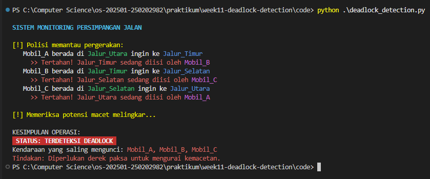
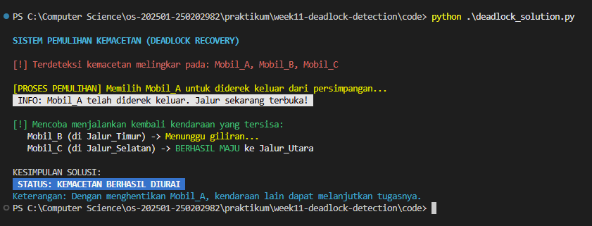

# Laporan Praktikum Minggu 11
Topik: Simulasi dan Mekanisme Deadlock Detection

---

## Identitas
- **Nama** : Prastian Hidayat
- **NIM** : 250202982 
- **Kelas** : 1IKRB

---

## Tujuan
Setelah menyelesaikan tugas ini, mahasiswa mampu:
1. Membuat program sederhana untuk mendeteksi deadlock.  
2. Menjalankan simulasi deteksi deadlock dengan dataset uji.  
3. Menyajikan hasil analisis deadlock dalam bentuk tabel.  
4. Memberikan interpretasi hasil uji secara logis dan sistematis.  
5. Menyusun laporan praktikum sesuai format yang ditentukan.

---

## Dasar Teori
- **Definisi Kebuntuan (Deadlock):** Sebuah kondisi dalam sistem operasi ketika sekumpulan proses berhenti bekerja karena setiap proses menunggu sumber daya yang sedang dikuasai oleh proses lain dalam kelompok tersebut.

- **Strategi Deteksi:** Berbeda dengan metode pencegahan, strategi deteksi membiarkan sistem menjalankan proses secara bebas, kemudian secara berkala memeriksa keberadaan siklus yang menyebabkan kebuntuan melalui pendekatan algoritmik.

- **Empat Syarat Utama:** Suatu kebuntuan dapat terdeteksi apabila memenuhi kriteria *Mutual Exclusion* , *Hold and Wait* , *No Preemption* , dan *Circular Wait*.
---

## Langkah Praktikum
1. **Menyiapkan Dataset**

   Membuat dataset sederhana yang berisi:
   - Daftar proses  
   - Resource Allocation  
   - Resource Request / Need

   Data tabel:

   | Proses | Allocation | Request |
   |:--|:--|:--|
   | Mobil_A | Jalur_Utara | Jalur_Timur |
   | Mobil_B | Jalur_Timur | Jalur_Selatan |
   | Mobil_C | Jalur_Selatan | Jalur_Utara |

2. **Implementasi Algoritma Deteksi Deadlock**

   Program:
   - Membaca data proses dan resource.  
   - Menentukan apakah sistem berada dalam kondisi deadlock.  
   - Menampilkan proses mana saja yang terlibat deadlock.

3. **Eksekusi & Validasi**

   - Menjalankan program dengan dataset uji.  
   - Memvalidasi hasil deteksi dengan analisis manual/logis.  
   - Menyimpan hasil eksekusi dalam bentuk screenshot.

4. **Analisis Hasil**

   - Menyajikan hasil deteksi dalam tabel (proses deadlock / tidak).  
   - Menjelaskan mengapa deadlock terjadi atau tidak terjadi.  
   - Mengaitkan hasil dengan teori deadlock (empat kondisi).

5. **Commit & Push**

   ```bash
   git add .
   git commit -m "Minggu 11 - Deadlock Detection"
   git push origin main
   ```
---

## Kode / Perintah

**1. Potongan Code deadlock_detection.py**

```python
import csv
import time
def baca_data_persimpangan(nama_file):
def cek_macet_melingkar(peta_tunggu, mobil_sekarang, sudah_dicek, antrean_pantau):
def simulasi_deteksi():
    posisi_jalan = {baris['Allocation']: baris['Proses'] for baris in catatan}
    
    # Tahap 2: Menganalisis pergerakan dan hambatan
    siapa_menunggu_siapa = {}
    print(Fore.YELLOW + "\n[!] Polisi memantau pergerakan:")
    
    for baris in catatan:
        mobil = baris['Proses']
        jalur_asal = baris['Allocation']
        jalur_tujuan = baris['Request']
        
        # Narasi detail sesuai permintaan: Mobil A di jalur X ingin ke jalur Y
        print(f"   {Fore.WHITE}{mobil} berada di {Fore.GREEN}{jalur_asal} {Fore.WHITE}ingin ke {Fore.BLUE}{jalur_tujuan}")
        
        if jalur_tujuan in posisi_jalan:
            penghalang = posisi_jalan[jalur_tujuan]
            siapa_menunggu_siapa[mobil] = [penghalang]
            print(f"     {Fore.RED}>> Tertahan! {jalur_tujuan} sedang diisi oleh {Fore.MAGENTA}{penghalang}")
        else:
            print(f"     {Fore.GREEN}>> Jalur tujuan kosong.")
        
        time.sleep(0.5)

    # Tahap 3: Deteksi lingkaran (Deadlock)
    print(Fore.YELLOW + "\n[!] Memeriksa potensi macet melingkar...")
    kendaraan_terjebak = []
    semua_mobil = [baris['Proses'] for baris in catatan]

    for mobil in semua_mobil:
        if cek_macet_melingkar(siapa_menunggu_siapa, mobil, set(), set()):
            kendaraan_terjebak.append(mobil)

if __name__ == "__main__":
    simulasi_deteksi()
```

**2. Potongan Code deadlock_solution.py**

```python
import csv
import time
def baca_data_persimpangan(nama_file):
def cari_siklus(peta_tunggu, mobil_sekarang, sudah_dicek, antrean_pantau):
def solusi_kemacetan():
    # 1. Deteksi Awal
    posisi_jalan = {baris['Allocation']: baris['Proses'] for baris in catatan}
    siapa_menunggu_siapa = {}
    for baris in catatan:
        mobil = baris['Proses']
        tujuan = baris['Request']
        if tujuan in posisi_jalan:
            siapa_menunggu_siapa[mobil] = [posisi_jalan[tujuan]]

    # Mencari mobil yang terjebak
    terjebak = []
    for mobil in [b['Proses'] for b in catatan]:
        if cari_siklus(siapa_menunggu_siapa, mobil, set(), set()):
            terjebak.append(mobil)

    if not terjebak:
        print(Fore.GREEN + "\n[!] Tidak ada kemacetan yang perlu diatasi.")
        return

    print(Fore.RED + f"\n[!] Terdeteksi kemacetan melingkar pada: {', '.join(terjebak)}")
    time.sleep(1)

    # 2. EKSEKUSI SOLUSI: Memilih Korban (Victim Selection)
    # Kita pilih mobil pertama dalam daftar untuk diderek (Terminasi)
    korban = terjebak[0]
    print(Fore.YELLOW + f"\n[PROSES PEMULIHAN] Memilih {korban} untuk diderek keluar dari persimpangan...")
    time.sleep(1.5)
    
    print(Back.WHITE + Fore.BLACK + f" INFO: {korban} telah diderek keluar. Jalur sekarang terbuka! ")
    time.sleep(1)

    # 3. SIMULASI PERGERAKAN SETELAH SOLUSI
    print(Fore.GREEN + "\n[!] Mencoba menjalankan kembali kendaraan yang tersisa:")
    
    # Mobil yang tersisa (tanpa si korban)
    sisa_mobil = [b for b in catatan if b['Proses'] != korban]
    
    for baris in sisa_mobil:
        mobil = baris['Proses']
        asal = baris['Allocation']
        tujuan = baris['Request']
        
        # Cek apakah jalur tujuan sudah kosong karena si korban sudah pergi
        if tujuan not in [b['Allocation'] for b in sisa_mobil]:
            print(f"   {Fore.WHITE}{mobil} (di {asal}) -> {Fore.GREEN}BERHASIL MAJU {Fore.WHITE}ke {tujuan}")
        else:
            # Jika masih menunggu mobil lain yang belum bergerak
            print(f"   {Fore.WHITE}{mobil} (di {asal}) -> {Fore.YELLOW}Menunggu giliran...")
        time.sleep(0.5)

if __name__ == "__main__":
    solusi_kemacetan()
```

**3. Perintah eksekusi**
```bash
python code/deadlock_detection.py
```
```bash
python code/deadlock_solution.py
```

---

## Hasil Eksekusi
Sertakan screenshot hasil percobaan atau diagram:

- **Hasil Mendeteksi Deadlock**



- **Hasil Solusi Dedlock**



---

## Analisis
Berdasarkan simulasi deteksi dan pemulihan yang dilakukan menggunakan program Python, dapat dianalisis terhadap perilaku sistem sebagai berikut:

  1. Identifikasi Pola Ketergantungan (*Circular Wait*) Program simulasi membaca data dari berkas **dataset_deadlock.csv** dan berhasil memetakan posisi setiap proses.

     - Proses P1 (Mobil A) memegang kendali penuh atas sumber daya R1 (Jalur Utara), namun proses ini berhenti bekerja karena menunggu sumber daya R2 (Jalur Timur).

     - Proses P2 (Mobil B) sedang menggunakan sumber daya R2 (Jalur Timur), tetapi ia juga tertahan karena membutuhkan sumber daya R3 (Jalur Selatan).

     - Proses P3 (Mobil C) menguasai sumber daya R3 (Jalur Selatan), namun kembali meminta akses ke sumber daya R1 (Jalur Utara) yang sedang dikunci oleh P1.

      Kondisi ini membentuk sebuah siklus tertutup. Dalam teori sistem operasi, fenomena ini memenuhi syarat utama terjadinya deadlock, yaitu *Circular Wait* (tunggu-menunggu secara melingkar).

  2. Kegagalan Sistem Tanpa Intervensi Program **deadlock_detection.py** menunjukkan bahwa tanpa adanya mekanisme eksternal, ketiga proses tersebut akan berada dalam status "menunggu" selamanya. Hal ini terjadi karena sistem menerapkan prinsip No Preemption, di mana sumber daya tidak dapat diambil paksa dari sebuah proses yang sedang memegangnya.

  3. Efektivitas Mekanisme Pemulihan (*Recovery*) Program **deadlock_solution.py** mendemonstrasikan solusi untuk mengurai kemacetan tersebut. Algoritma melakukan seleksi korban (*victim selection*) dengan cara memilih salah satu proses yang terjebak (dalam hal ini P1/Mobil A) untuk dihentikan paksa (*terminated*).

     - Setelah P1 dihentikan, sumber daya R1 menjadi bebas.

     - P3 kemudian dapat mengambil R1 dan menyelesaikan tugasnya.

     - Setelah P3 selesai, R3 menjadi bebas sehingga P2 dapat melanjutkan prosesnya. Simulasi ini membuktikan bahwa pengorbanan satu proses diperlukan untuk menyelamatkan kinerja sistem secara keseluruhan.
  
---

## Kesimpulan
1. **Deteksi Dini Sangat Krusial:** Algoritma deteksi deadlock bekerja efektif dengan cara memantau grafik alokasi sumber daya (*Resource Allocation Graph*). Sistem mampu mengenali bahaya "kemacetan" dengan melacak adanya siklus putaran (*cycle*) dalam permintaan sumber daya antar-proses.

2. **Empat Syarat Deadlock Terbukti:** Percobaan ini memvalidasi teori bahwa deadlock hanya akan terjadi jika empat kondisi terpenuhi secara bersamaan, yaitu: *Mutual Exclusion* (satu jalur satu kendaraan), *Hold and Wait* (berhenti sambil memegang jalur), *No Preemption* (tidak bisa usir paksa), dan *Circular Wait* (saling tunggu melingkar).

3.**Solusi Memerlukan Tindakan Tegas:** Berbeda dengan strategi pencegahan, strategi pemulihan (recovery) mengharuskan sistem untuk mengambil tindakan tegas. Mematikan proses (terminating process) adalah metode yang paling efektif untuk memutus mata rantai ketergantungan, meskipun hal tersebut berisiko menyebabkan hilangnya progres kerja pada proses yang dikorbankan.

---

## Quiz
1. **Apa perbedaan antara *deadlock prevention*, *avoidance*, dan *detection*?**
       
   **Jawaban:** 
   - **Pencegahan (Prevention)**: Memastikan salah satu dari empat syarat deadlock tidak terpenuhi secara permanen.

   - **Penghindaran (Avoidance)**: Menilai setiap permintaan sumber daya secara dinamis untuk memastikan sistem tetap dalam kondisi aman.

   - **Deteksi (Detection)**: Membiarkan deadlock terjadi, kemudian menggunakan algoritme untuk mengidentifikasi proses yang bermasalah. 
  
2. **Mengapa deteksi deadlock tetap diperlukan dalam sistem operasi?** 
   
   **Jawaban:**  
   - Deteksi tetap diperlukan karena metode pencegahan dan penghindaran sering kali mengakibatkan utilisasi sumber daya yang rendah dan membatasi kinerja sistem secara berlebihan.

3. **Apa kelebihan dan kekurangan pendekatan deteksi deadlock?**  
   
   **Jawaban:**
   - **Kelebihan:** Penggunaan sumber daya menjadi lebih maksimal karena sistem tidak bersifat terlalu restriktif di awal.

   - **Kekurangan:** Terdapat biaya komputasi tambahan (overhead) untuk menjalankan algoritme deteksi dan diperlukan mekanisme pemulihan yang kompleks setelah deadlock ditemukan.  

---

## Refleksi Diri
Tuliskan secara singkat:
- Apa bagian yang paling menantang minggu ini?  
- Bagaimana cara Anda mengatasinya?  

---

**Credit:**  
_Template laporan praktikum Sistem Operasi (SO-202501) – Universitas Putra Bangsa_
