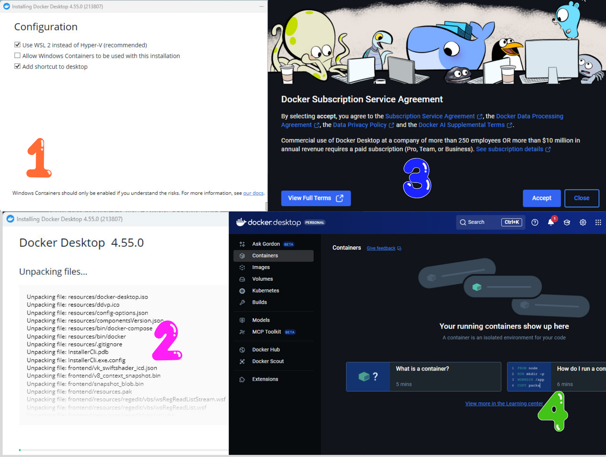
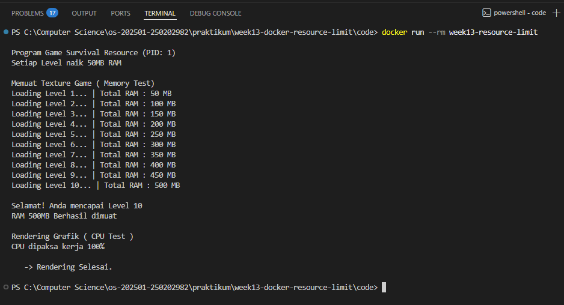
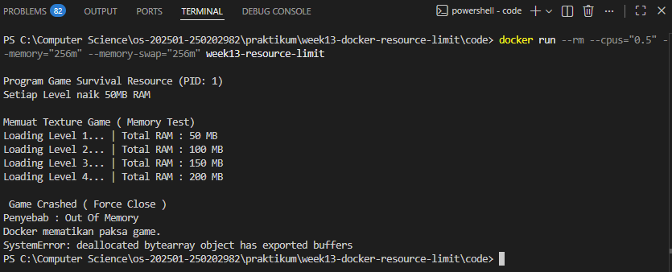
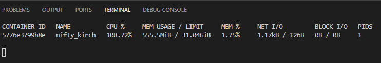
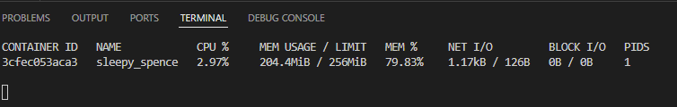

# Laporan Praktikum Minggu 13
Topik: Docker – Resource Limit (CPU & Memori)

---

## Identitas
- **Nama** : Prastian Hidayat
- **NIM** : 250202982
- **Kelas** : 1IKRB

---

## Tujuan
Setelah menyelesaikan praktikum ini, mahasiswa diharapkan mampu:
1.  Menulis Dockerfile sederhana untuk membungkus aplikasi atau skrip uji.
2.  Membangun (build) image dan menjalankan container dari image tersebut.
3.  Menerapkan pembatasan sumber daya (Resource Limit) berupa CPU dan Memori pada container.
4.  Mengamati dan menganalisis perilaku container saat dijalankan dengan dan tanpa batasan resource.
5.  Memahami mekanisme sistem operasi dalam menangani proses yang melebihi batas alokasi memori (OOM Kill).

---

## Dasar Teori

### Docker & Containerization
Docker adalah platform untuk mengemas aplikasi beserta seluruh dependensinya (library, konfigurasi) ke dalam sebuah unit standar yang disebut **Container**. Berbeda dengan Virtual Machine (VM) yang meniru perangkat keras dan membutuhkan OS penuh, container berjalan di atas kernel OS host yang sama namun terisolasi satu sama lain. Hal ini membuat container jauh lebih ringan dan cepat.

### Resource Isolation & Cgroups
Cgroups memungkinkan sistem untuk membatasi, menghitung, dan mengisolasi penggunaan sumber daya (CPU, memori, disk I/O, network) dari sekumpulan proses. Dengan fitur ini, kita dapat memastikan bahwa satu container tidak menghabiskan seluruh sumber daya host yang dapat mengganggu kinerja container lain atau sistem utama.

### Memory Limit & OOM Killed
Ketika sebuah container dibatasi penggunaan memorinya (misalnya 256MB), kernel akan memantau konsumsi RAM container tersebut. Jika aplikasi di dalam container mencoba mengalokasikan memori melebihi batas yang ditentukan (Hard Limit) dan tidak ada ruang Swap yang tersedia, kernel Linux akan melakukan tindakan terminasi paksa yang disebut **OOM (Out Of Memory) Killer**. Proses akan dimatikan seketika untuk menjaga stabilitas sistem, biasanya ditandai dengan Exit Code 137.

### Dockerfile
Dockerfile adalah file teks berisi serangkaian instruksi yang dibaca oleh Docker untuk membangun sebuah image secara otomatis. Instruksi umum meliputi `FROM` (base image), `WORKDIR` (direktori kerja), `COPY` (menyalin file), dan `CMD` (perintah eksekusi).

## Langkah Praktikum

### A. Persiapan & Instalasi
1.  Mengunduh aplikasi **Docker Dekstop**.
    -  **Docker Dekstop** : https://www.docker.com/products/docker-desktop/ 
2.  Menginstall Docker Desktop pada PC atau Laptop.
3.  Membuka Aplikasi agar server docker berjalan
4.  Install Extension `Container Tools` agar bisa berjalan di `Visual Code Studio`
5.  Pastikan Docker terpasang dan berjalan dengan perintah:
   ```bash
      docker version
      docker ps
   ```

### B. Pembuatan Program Uji (`app.py`) dan Dockerfile
1. Membuat script Python dengan skenario "Game Survival" dengan nama `app.py` kemudian simpan code script di folder `code/app.py`
2. Membuat file `Dockerfile` menggunakan base image python terbaru `python:3.11.14-alpine3.23` kemudian simpan code di folder `code/Dockerfile`
   
### C. Build Image
1. Melakukan proses build image dari Dockerfile dengan nama tag `week13-resource-limit`.
2. Screenshots output terminal dari hasil proses build kemudian simpan di folder `screenshots/docker-build.png`

### D. Tahap Pengujian
1. Menjalankan container secara normal tanpa batasan resource untuk membuktikan bahwa program dapat berjalan hingga selesai (mencapai target 500MB) jika sumber daya mencukupi.
2. Screenshots hasilnya kemudian simpan file tersebut di folder `screenshots/docker-limited.png`.
3. Menjalankan container dengan batasan memori 256MB (`--memory="256m"`). Mengamati perilaku program yang terhenti di tengah jalan  karena kehabisan memori.
4. Screenshots hasilnya kemudian simpan file tersebut di folder `screenshots/docker-256mb.png`.

### E. Monitoring Sederhana
1. Jalankan container (tanpa `--rm` jika perlu) dan amati penggunaan resource:
     ```bash
     docker stats
     ```
2. Screenshot output eksekusi dan/atau `docker stats`.

### F. Commit & Push

   ```bash
   git add .
   git commit -m "Minggu 13 - Docker Resource Limit"
   git push origin main
   ```

---

## Kode / Perintah

### 1. Struktur File
```
praktikum/week13-docker-resource-limit/
├─ code/
│  ├─ app.py
│  └─ Dockerfile
├─ screenshots/
│  ├─ docker-256mb.png
|  ├─ docker-build.png
|  └─ docker-limited.png
└─ laporan.md
```
### 2. Isi File Dockerfile
```python
# Gunakan image Python 
FROM python:3.11.14-alpine3.23

# Paksa Python matikan buffering
ENV PYTHONUNBUFFERED=1

# Set folder kerja di dalam container
WORKDIR /app

# Salin file app.py ke dalam container
COPY app.py .

# Perintah untuk menjalankan aplikasi
CMD ["python", "app.py"]
```
### 3. Isi File app.py
```python
import os
import time
import sys

def game():
    print(f"\nProgram Game Survival Resource (PID: {os.getpid()})")
    print(f"Setiap Level naik 50MB RAM ")

    print("\nMemuat Texture Game ( Memory Test)")
    ram_use = []

    survival = bytearray(50 * 1024 * 1024) # 50 MB RAM

    try:
        for level in range(1,11):
            print(f"Loading Level {level}... | Total RAM : {level * 50} MB")
            ram_use.append(survival[:])

            time.sleep(1)

        print(f"\nSelamat! Anda mencapai Level {level}")
        print("RAM 500MB Berhasil dimuat")

    except MemoryError:
        print("\n Game Crashed ( Force Close )")
        print("Penyebab : Out Of Memory")
        print("Docker mematikan paksa game.")

        sys.exit(1)

    print("\nRendering Grafik ( CPU Test )")
    print("CPU dipaksa kerja 100%\n")

    start_time = time.time()
    while time.time() - start_time < 5:
        _ = [x**2 for x in range(5000)]
    
    print("   -> Rendering Selesai.\n")

if __name__ == "__main__":
    game()
```

4. Command Docker
* Command untuk proses Build Image
  ```bash
   docker build -t week13-resource-limit .
   ```
* Command untuk proses menjalankan container tanpa limit resource.
  ```bash
   docker run --rm week13-resource-limit
   ```
* Command untuk proses menjalankan container dengan limit resource.
  ```bash
   docker run --rm --cpus="0.5" --memory="256m" --memory-swap="256m" week13-resource-limit
   ```
---

## Hasil Eksekusi

Berikut adalah dokumentasi bukti keberhasilan instalasi Docker dan eksperimen pembatasan sumber daya (Resource Limit).

### 1. Instalasi Docker Desktop
Proses instalasi Docker Desktop pada sistem operasi Windows.

<p align="center">
  
</p>


### 2. Pengujian Tanpa Limit (Normal Run)
Pada pengujian pertama, container dijalankan tanpa pembatasan resource.
* **Perintah:** `docker run --rm week13-resource-limit`
* **Hasil:** Program "Game Survival" berhasil memuat texture hingga **Level 10 (Total 500 MB)**.

<p align="center">
  
</p>

### 3. Pengujian Dengan Limit (Crash / OOM Killed)
Pada pengujian kedua, container dibatasi secara ketat: **RAM 256MB** dan **Swap 256MB** (Swap dimatikan agar limit efektif).
* **Perintah:** `docker run --rm --cpus="0.5" --memory="256m" --memory-swap="256m" week13-resource-limit`
* **Hasil:** Program berjalan lancar dari Level 1 hingga Level 4 (200 MB). Namun, saat mencoba memuat Level 5 (250 MB), program **berhenti mendadak** dengan pesan error **Out Of Memory**.

<p align="center">
  
</p>

### 4. Docker Motinoring
Saya lakukan monitoring CPU dan Memory RAM dengan `docker stats`.
* **Hasil:** Pengujian Normal Run mendeteksi RAM Local PC yaitu 32GB, sehingga bisa mencapai level 10 "Game Survival" tanpa adanya problem apapun, meskipun pada kenyataanya RAM yang terpakai bukan hanya 500MB tetapi 555MB karena ada program lain pihak luar yang berjalan.
<p align="center">
  
</p>

* **Hasil:** Pengujian dengan Limit yang secara teoritis bisa mencapai Level 5 tetapi kenyataannya hanya bisa mencapai level 4 karena ada sejumlah RAM untuk program lain pihak luar.
<p align="center">
  
</p>
---

## Analisis

Berdasarkan rangkaian percobaan yang telah dilakukan menggunakan skenario "Game Survival" , berikut adalah analisis mendalam mengenai perilaku container dan manajemen sumber daya:

### 1. Performa Container Tanpa Limit (Unbounded)
Pada percobaan pertama tanpa pembatasan resource, container mampu menjalankan program hingga selesai (**Level 10 / 500 MB**). Hal ini menunjukkan bahwa secara default, Docker tidak membatasi akses container terhadap sumber daya Host. Container dapat menggunakan RAM sebanyak yang tersedia di laptop (Host OS), yang membuktikan efisiensi Docker dalam memberikan performa mendekati *native* (asli).

### 2. Analisis Limitasi Memori dan Overhead Sistem
Pada percobaan kedua dengan limitasi ketat (**256 MB**), terjadi fenomena menarik. Secara teoritis, Level 5 membutuhkan 250 MB (5 x 50 MB), yang seharusnya masih muat di dalam batas 256 MB. Namun, dalam praktiknya, program **terhenti setelah menyelesaikan Level 4** dan gagal saat mencoba memuat Level 5.

Penyebab utamanya adalah **System Overhead**. Di dalam container, memori tidak hanya dipakai oleh variabel Python (`app.py`), tetapi juga oleh:
* **Runtime Python:** Interpreter Python sendiri membutuhkan memori dasar sekitar 10-20 MB.
* **Proses Sistem:** Proses minimal sistem operasi (Linux Alpine/Debian) di dalam container.
* **Buffer I/O:** Alokasi sementara untuk input/output terminal.

Akibatnya, sisa ruang untuk aplikasi kurang dari 256 MB. Ketika program mencoba mengalokasikan total 250 MB di Level 5, memori fisik yang tersisa tidak cukup (karena terpotong overhead), sehingga memicu **OOM Kill** lebih awal dari hitungan matematis kasar.

### 3. Peran dan Konfigurasi Swap Memory
Dalam percobaan ini, kita secara spesifik mengatur parameter `--memory-swap` dengan nilai yang sama dengan limit memori (256MB).
* **Fungsi Swap:** Normalnya, swap berfungsi sebagai "memori cadangan" di hard disk saat RAM penuh, mencegah aplikasi crash.
* **Mengapa dibatasi?** Kita sengaja mematikan fungsi swap tambahan ini agar simulasi menjadi akurat. Jika swap dibiarkan aktif (default), program `app.py` yang kehabisan RAM akan "tumpah" ke disk dan tetap berjalan lambat, sehingga kita tidak bisa melihat efek *resource limit* yang mematikan proses (crash). Pengaturan ini memaksa sistem untuk benar-benar hanya mengandalkan RAM fisik.

### 4. Efisiensi Isolasi dan Manfaat Docker
Percobaan ini mendemonstrasikan keunggulan utama Docker dibandingkan Virtual Machine (VM):
* **Isolasi Aman:** Meskipun program di dalam container mengalami *crash* karena kehabisan memori, sistem operasi utama (Windows) tetap stabil dan tidak terganggu. Kerusakan terisolasi hanya di dalam container.
* **Efisiensi Sumber Daya:** Docker menggunakan fitur kernel *Namespaces* dan *Cgroups*. Berbeda dengan VM yang memakan resource besar untuk menjalankan satu OS utuh, Docker berbagi kernel dengan Host sehingga *overhead*-nya sangat kecil. Kita bisa menjalankan limitasi CPU dan Memori yang presisi (seperti 0.5 CPU) tanpa perlu konfigurasi hardware virtual yang rumit.
---

## Kesimpulan

Berdasarkan praktikum ini, dapat disimpulkan bahwa :
1. Docker secara default mengizinkan container menggunakan sumber daya host secara penuh yang dibuktikan dengan keberhasilan program mencapai target maksimal tanpa kendala. Namun, saat limitasi memori 256MB diterapkan, program terhenti lebih cepat dari perhitungan matematis akibat adanya konsumsi memori tambahan oleh sistem operasi dan runtime Python di dalam container.
2. Mekanisme OOM Killer bekerja efektif mematikan proses yang melanggar batas memori demi menjaga stabilitas sistem utama. 
3. Pengaturan swap memori terbukti sangat krusial karena harus disesuaikan dengan batas RAM agar aplikasi tidak beralih menggunakan disk saat memori fisik habis, sehingga simulasi pembatasan sumber daya menjadi akurat.
---

## Quiz

**1. Mengapa container perlu dibatasi CPU dan memori?**

   **Jawaban**

   * Penerapan batasan (limits) pada CPU dan memori dalam lingkungan kontainerisasi sangat krusial untuk menjamin stabilitas, efisiensi, dan reliabilitas infrastruktur komputasi awan. Secara teknis, mekanisme ini umumnya diimplementasikan menggunakan fitur kernel Linux, yaitu Control Groups (cgroups), untuk membatasi, menghitung, dan mengisolasi penggunaan sumber daya. 

**2. Apa perbedaan VM dan container dalam konteks isolasi resource?**

   **Jawaban**

   * **VM (Virtual Machine):** Isolasi dilakukan di level Hardware. VM memiliki kernel dan OS sendiri yang terpisah total. Sangat aman, tapi berat (memakan RAM statis besar).
   * **Container:** Isolasi dilakukan di level OS (menggunakan Namespaces & Cgroups). Semua container berbagi kernel milik Host. Lebih ringan dan efisien, namun isolasinya tidak sekompleks VM.

**3. Apa dampak limit memori terhadap aplikasi yang boros memori?**

   **Jawaban**

   * **Jika Swap Aktif:** Aplikasi akan menjadi sangat lambat (*thrashing*) karena sistem sibuk memindahkan data dari RAM ke Disk.
   * **Jika Swap Mati/Penuh:** Aplikasi akan langsung dimatikan paksa oleh sistem (*OOM Killed*), menyebabkan layanan down tiba-tiba.

---

## Refleksi Diri
Tuliskan secara singkat:
- Apa bagian yang paling menantang minggu ini?  
- Bagaimana cara Anda mengatasinya?  

---

**Credit:**  
_Template laporan praktikum Sistem Operasi (SO-202501) – Universitas Putra Bangsa_