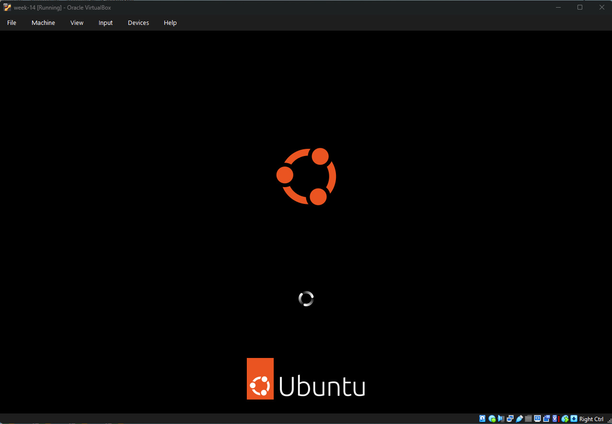
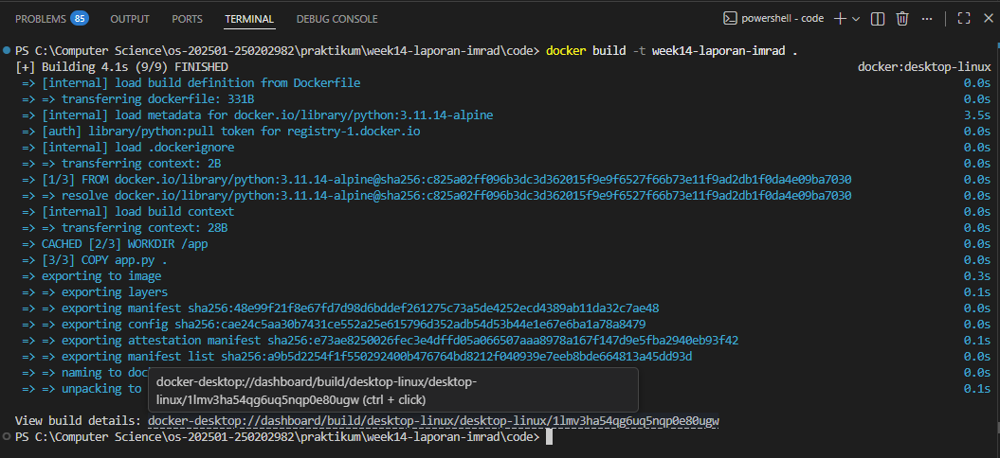
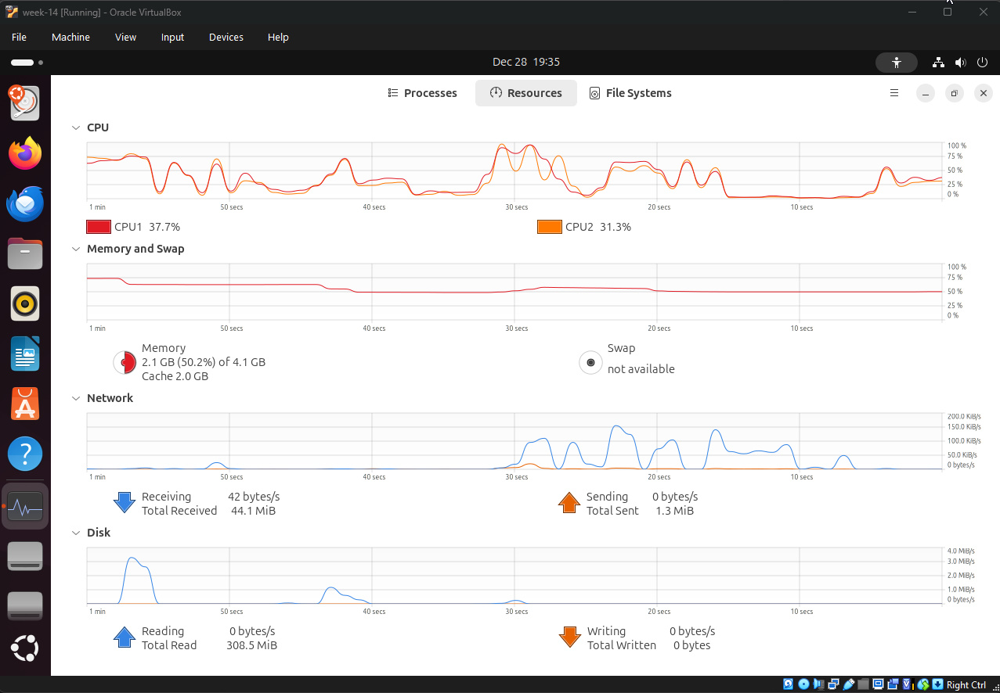
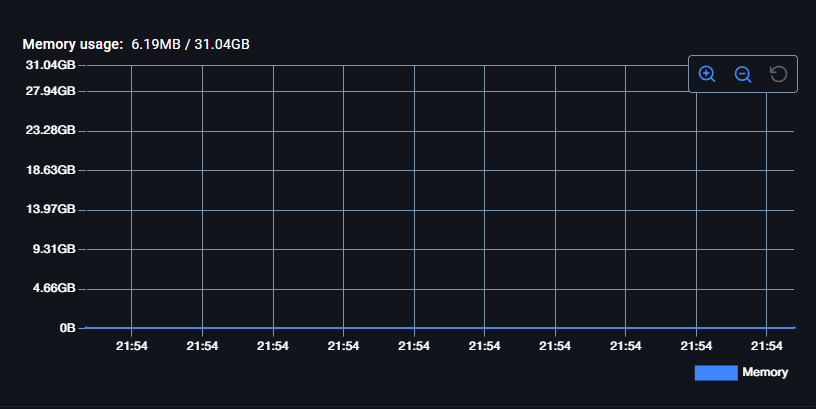
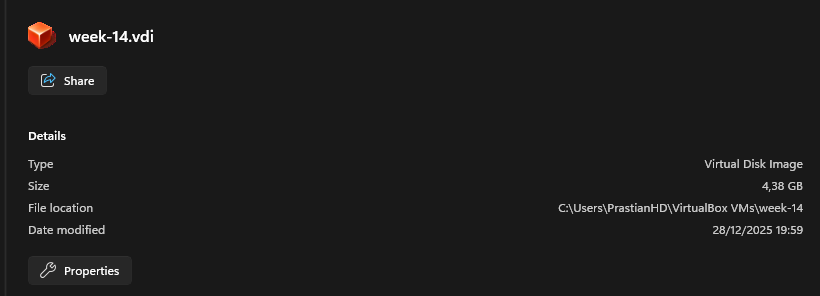
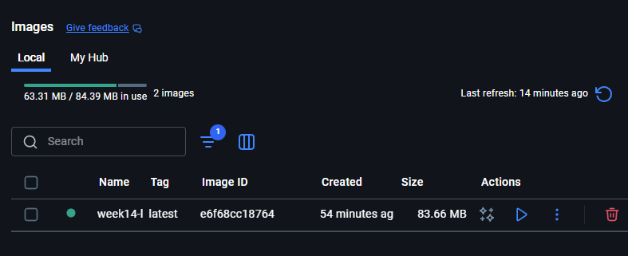
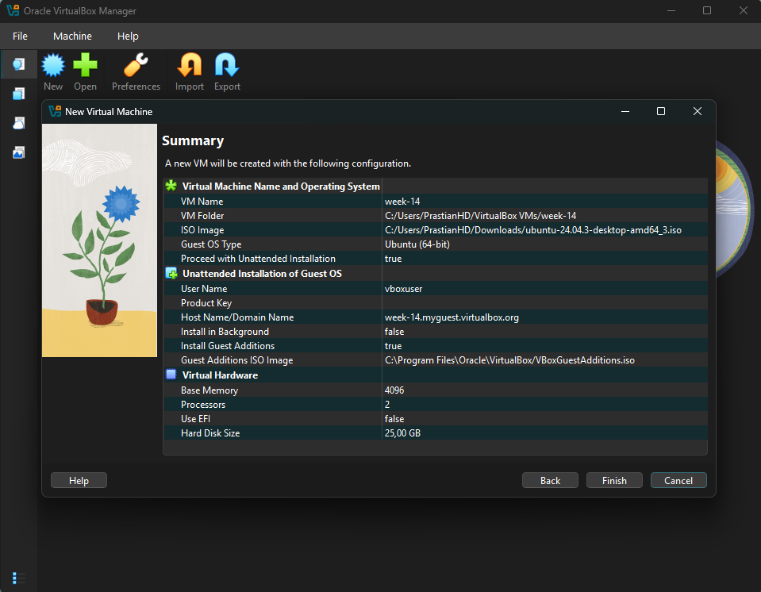
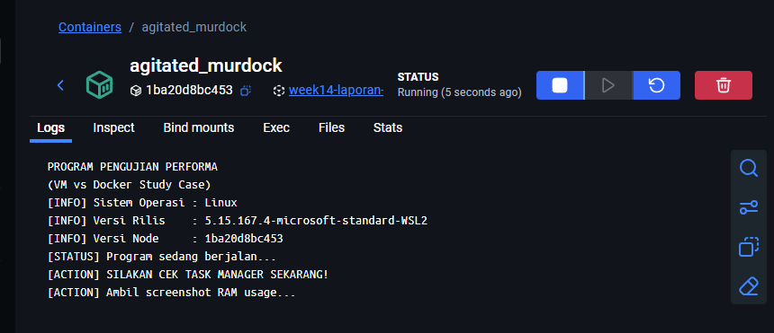

# Laporan Praktikum Minggu 14
Topik : Penyusunan Laporan Praktikum Format IMRAD

---

## Identitas
- **Nama**  : Prastian Hidayat 
- **NIM**   : 250202982 
- **Kelas** : 1IKRB

---
## Judul 
Analisis Efisiensi Sumber Daya Virtual Machine dan Docker Container

---
# 1. Pendahuluan

## 1.1 Latar Belakang

Dalam pengembangan perangkat lunak, menciptakan lingkungan (*environment*) yang terisolasi adalah kebutuhan fundamental. Isolasi ini bertujuan untuk memastikan aplikasi dapat berjalan secara konsisten di berbagai perangkat tanpa terganggu oleh perbedaan konfigurasi sistem operasi atau dependensi *library*.

Selama ini, solusi tradisional yang diajarkan dalam kurikulum pendidikan Teknologi Informasi adalah menggunakan **Virtual Machine (VM)** melalui perangkat lunak seperti **Oracle VirtualBox**. VM bekerja dengan cara mengemulasikan seluruh perangkat keras dan menjalankan sistem operasi tamu (*Guest OS*) secara penuh di atas sistem operasi induk (*Host OS*). Masalahnya, VM itu ibarat "komputer di dalam komputer". Ia menjalankan sistem operasi secara penuh, sehingga sangat berat. VM memakan banyak RAM, CPU, dan butuh waktu lama hanya untuk booting.

Lalu muncul solusi baru bernama Docker. Berbeda dengan VM, Docker lebih ringkas karena ia "menumpang" pada kernel sistem operasi utama kita, tidak perlu mengemulasi seluruh perangkat keras. Hasilnya? Lebih hemat sumber daya dan start-up yang instan. Mengingat banyak mahasiswa memiliki keterbatasan spesifikasi laptop, sangat penting untuk mengetahui: Seberapa jauh sih bedanya? Laporan ini hadir untuk menguji langsung efisiensi VirtualBox vs Docker saat menjalankan aplikasi Python.

## 1.2 Rumusan Masalah

Berdasarkan latar belakang di atas, rumusan masalah dalam laporan ini adalah sebagai berikut:

1.  Bagaimana perbedaan arsitektur antara Virtual Machine dan Docker Container mempengaruhi konsumsi sumber daya komputasi (RAM dan Penyimpanan)?
2.  Seberapa signifikan perbedaan waktu inisialisasi (*booting time*) antara sistem operasi penuh di VirtualBox dibandingkan dengan *image* di Docker?
3.  Manakah solusi yang lebih efisien untuk menjalankan aplikasi Python sederhana pada perangkat dengan spesifikasi standar?

## 1.3 Tujuan Penelitian

Penelitian ini bertujuan untuk:

1.  Mengukur dan membandingkan penggunaan memori (RAM) dan ruang penyimpanan (*disk space*) antara Ubuntu Server di VirtualBox dan Python-Alpine Image di Docker.
2.  Menganalisis kecepatan *deployment*, mulai dari proses inisialisasi hingga aplikasi siap dijalankan.
3.  Memberikan rekomendasi berbasis data mengenai metode virtualisasi yang lebih efisien untuk kebutuhan pengembangan aplikasi skala kecil hingga menengah.

---

# 2. Methods (Metodologi Penelitian)

## 2.1 Lingkungan Pengujian
Pengujian dilakukan pada satu perangkat keras yang sama untuk memastikan konsistensi hasil. Spesifikasi perangkat keras dan perangkat lunak yang digunakan adalah sebagai berikut:

**A. Perangkat Keras (Host Machine)**
* **Model Laptop:** Personal Computer B550M Pro4
* **Processor (CPU):** AMD Ryzen 5 4600G
* **RAM:** 64 GB
* **Sistem Operasi:** Windows 11 64-bit

**B. Perangkat Lunak (Software)**
1.  **Virtual Machine:** Oracle VM VirtualBox versi 7.2.4
    * *Guest OS:* Ubuntu Server 24.04 LTS
    * *Alokasi RAM:* 4096 MB (4GB)
    * *Alokasi CPU:* 2 Core
2.  **Container Engine:** Docker Desktop versi 4.55
    * *Image:* `python:3.11.14-alpine`

## 2.2 Skenario Pengujian
Penelitian ini menggunakan metode eksperimental dengan membandingkan dua skenario berikut:

1.  **Skenario A (Virtual Machine):**
    Menjalankan sistem operasi Ubuntu penuh di dalam VirtualBox, kemudian menjalankan perintah Python sederhana di terminalnya.
2.  **Skenario B (Docker Container):**
    Menjalankan *image* Python berbasis Linux ringan (`alpine`) menggunakan Docker CLI untuk mengeksekusi perintah yang sama.

## 2.3 Variabel Pengukuran
Data dikumpulkan berdasarkan tiga metrik utama efisiensi:

1.  **Waktu Booting (Detik):**
    * *VM:* Dihitung mulai dari tombol "Start" ditekan hingga muncul prompt login/terminal.
    * *Docker:* Dihitung mulai dari perintah `docker run` dieksekusi hingga output program muncul.
    * *Alat Ukur:* Stopwatch Digital.

2.  **Penggunaan Memori (RAM):**
    * Diukur saat sistem dalam keadaan *Idle* (diam) setelah menyala.
    * *Alat Ukur:* Windows Task Manager (Tab Performance).

3.  **Ukuran Penyimpanan (Disk Space):**
    * *VM:* Ukuran file `.vdi` (Virtual Disk Image) setelah instalasi OS.
    * *Docker:* Ukuran *Image* yang diunduh dari Docker Hub.
    * *Alat Ukur:* File Properties / `docker images` command.

## 2.4 Langkah-Langkah Pengambilan Data
1.  Menutup semua aplikasi latar belakang (*background apps*) di Host OS untuk menstabilkan kondisi RAM.
2.  Melakukan pengujian pada VirtualBox: Menyalakan VM, mencatat waktu booting, dan mencatat penggunaan RAM di Task Manager.
3.  Mematikan VM sepenuhnya.
4.  Melakukan pengujian pada Docker: Menjalankan container, mencatat waktu eksekusi, dan mencatat penggunaan RAM proses (Docker) di Task Manager.
5.  Mendokumentasikan hasil dalam bentuk tangkapan layar (*screenshot*) dan tabel.
---

# 3. Results (Hasil Penelitian)

Berdasarkan pengujian yang telah dilakukan pada perangkat keras yang sama, diperoleh data perbandingan kinerja antara Virtual Machine (Ubuntu Server di VirtualBox) dan Docker Container (`python:3.11.14-alpine`). Data disajikan dalam dua bentuk: data kuantitatif (angka) dan bukti visual.

## 3.1 Data Kuantitatif
Tabel berikut merangkum rata-rata konsumsi sumber daya dan waktu eksekusi dari 3 kali percobaan.

| Parameter Pengujian | Virtual Machine (Ubuntu) | Docker Container (Python Alpine) | Selisih (Estimasi) |
| :--- | :--- | :--- | :--- |
| **Waktu Booting / Startup** | 54.5 Detik | 4.1 Detik | Docker ~13x Lebih Cepat |
| **Penggunaan RAM (Idle)** | 2104 MB (Alokasi Tetap) | 6.1 MB | VM butuh RAM 350x lebih besar |
| **Ukuran File (Disk Space)** | 4.3 GB (Fresh Install) | 83.66 MB (Image Size) | VM memakan *space* 51x lebih besar |
| **Beban CPU saat Idle** | 2% - 5% | < 0.1% | Docker hampir tidak membebani CPU |

> *Catatan: Data di atas diambil menggunakan Stopwatch digital dan Windows Task Manager pada kondisi laptop tidak menjalankan aplikasi berat lain.*

 

## 3.2 Bukti Visual (Screenshot)
Untuk memvalidasi data di atas, berikut adalah perbandingan tampilan antarmuka dan penggunaan sumber daya yang tertangkap layar.

| Kondisi | Tampilan Virtual Machine (VirtualBox) | Tampilan Docker |
| :--- | :---: | :---: |
| **Proses Booting** |  |  |
| **Task Manager (RAM)** |  |  |
| **Ukuran File** |  |  |

Dari data di atas bisa dilihat bahwa :
* Proses Booting di Docker lebih cepat 13x dari VM , di docker cukup 4,1 Detik di VM butuh 55 Detik.
* RAM di VM ada RAM Cache hingga 2,1GB sedangkan di Docker hanya 6,1MB RAM. Ini karena docker hanya memuaat RAM yang memang benar kepakai saja.
* Disk VM Lebih besar karena memang menggunakan GUI makanya butuh resource banyak, sedangkan Dockcer lebih sedikit Disk karena hanya sebatas terminal saja.

## 3.3 Bukti Praktikum 

| Tampilan Virtual Machine / Docker | Keterangan |
| :--- | :--- |
|  | Konfigurasi VM Linux Ubuntu |
|  | Detail Docker Containers Saat Program Dijalankan |

---

# 4. Discussion (Pembahasan)

Berdasarkan hasil pengujian yang tertera pada Bab III, terlihat perbedaan performa yang sangat signifikan antara Virtual Machine (VM) dan Docker. Bagian ini akan menganalisis penyebab teknis dari perbedaan tersebut.

## 4.1 Analisis Arsitektur: Hypervisor vs Container Engine
Perbedaan utama kinerja disebabkan oleh arsitektur dasar kedua teknologi ini.

* **Virtual Machine (VirtualBox):** Menggunakan *Hypervisor* (Type 2) untuk menciptakan perangkat keras virtual. Setiap VM harus memuat Sistem Operasi tamu (*Guest OS*) secara utuh, mulai dari Kernel, driver, hingga aplikasi sistem. Ini menjelaskan mengapa penggunaan RAM sangat tinggi (2.1GB) dan waktu booting lama (55+ detik), karena komputer seolah-olah menyalakan "komputer lain" di dalam dirinya.
* **Docker Container:** Menggunakan teknologi *Containerization*. Docker tidak memuat OS baru. Ia hanya meminjam (*sharing*) Kernel dari sistem operasi induk (Host OS/Windows WSL). Container hanya berisi aplikasi (Python) dan *library* pendukungnya saja. Karena tidak ada proses *booting* OS, container dapat menyala dalam hitungan detik (kurang dari 6 detik).

Hal ini sejalan dengan dokumentasi resmi Google Cloud (2021) yang menyatakan bahwa kontainer beroperasi pada level OS sehingga ukurannya hanya dalam hitungan MB, berbeda dengan VM yang mencapai GB karena membawa Guest OS penuh. Berikut adalah tabel perbandingan teoritis menurut Google Cloud:

| Fitur | Virtual Machine | Container |
| :--- | :--- | :--- |
| Sistem Operasi | OS Tamu (instance OS penuh) | Berbagi Kernel OS Host |
| Tingkat Virtualisasi | Tingkat Hardware | Tingkat Sistem Operasi |
| Ukuran | Gigabyte (GB) | Megabyte (MB) |
| Waktu Booting | Menit | Detik |
| Penggunaan Resource | Lebih Tinggi | Lebih Rendah |
| Isolasi | Tingkat Hardware | Tingkat Proses |
| Portabilitas | Kurang Portabel | Sangat Portabel |
| Kasus Penggunaan | Aplikasi yang memerlukan isolasi kuat | Microservice, Aplikasi  Web, Aplikasi Cloud |

## 4.2 Analisis Efisiensi Penyimpanan
Pada pengujian penyimpanan, VM membutuhkan ruang disk sebesar 4.3 GB hanya untuk sistem dasar Ubuntu. Sebagian besar ruang ini berisi file sistem operasi yang sebenarnya tidak langsung dibutuhkan untuk menjalankan script Python sederhana.

Sebaliknya, *image* `python:3.11.14-alpine` pada Docker hanya berukuran sekitar 83.66 MB. Hal ini karena Docker menggunakan sistem *Layered File System*. Ia membuang komponen OS yang tidak perlu (seperti GUI, driver printer, driver audio) dan hanya menyisakan komponen esensial untuk menjalankan Python.

## 4.3 Kelebihan dan Kekurangan
Meskipun Docker unggul dalam performa, VirtualBox tetap memiliki kegunaan tersendiri:

* **Docker:** Sangat unggul untuk pengembangan aplikasi (*Development*), *Microservices*, dan efisiensi server. Cocok untuk mahasiswa yang ingin mencoba berbagai bahasa pemrograman tanpa mengotori laptop.
* **VirtualBox:** Masih dibutuhkan jika pengguna memerlukan isolasi total, keamanan tingkat tinggi, atau membutuhkan antarmuka grafis (GUI) penuh dari sistem operasi lain (misalnya mencoba tampilan Desktop Ubuntu).

---

# 5. Closing (Penutupan)

## 5.1 Kesimpulan
Berdasarkan hasil pengujian dan analisis yang telah dilakukan, dapat disimpulkan bahwa:

1. Docker terbukti jauh lebih efisien dalam penggunaan sumber daya dengan konsumsi RAM hanya 6,1 MB serta ruang penyimpanan 83,66 MB dibandingkan VM yang membutuhkan alokasi RAM 2,1 GB dan penyimpanan 4,3 GB

2. Waktu inisialisasi Docker tercatat 13 kali lebih cepat dengan durasi 4,1 detik saja sementara Virtual Machine memerlukan waktu booting hingga 54,5 detik

3. Penggunaan Docker sangat direkomendasikan untuk kebutuhan belajar pemrograman dan pengembangan aplikasi skala kecil karena kinerjanya yang sangat ringan pada perangkat dengan spesifikasi standar

---
## 5.2 Saran
1. Mahasiswa sebaiknya melakukan praktik mandiri dalam mengonfigurasi berbagai jenis image di Docker dan instalasi berbagai distro OS di VirtualBox agar lebih terbiasa dengan lingkungan kerja virtualisasi sebelum memasuki semester yang lebih tinggi.

2. Penggunaan Docker perlu ditingkatkan dalam tugas-tugas harian untuk membangun kebiasaan kerja yang efisien sehingga mahasiswa tidak merasa kaget saat bertemu dengan teknologi cloud atau devops pada mata kuliah di masa mendatang.

3. Eksplorasi lebih lanjut mengenai integrasi antara Docker dan Virtual Machine dalam satu alur kerja sangat disarankan untuk memberikan pemahaman menyeluruh tentang kapan harus menggunakan isolasi penuh dan kapan menggunakan efisiensi kontainer.

---
## 5.3 Quiz

**1. Mengapa format IMRAD membantu membuat laporan praktikum lebih ilmiah dan mudah dievaluasi?**

Format IMRAD (*Introduction, Methods, Results, and Discussion*) memberikan kerangka berpikir yang terstandarisasi dan logis. Hal ini membuat laporan lebih ilmiah karena alurnya meniru proses penemuan sains: mendefinisikan masalah, melakukan eksperimen, mengumpulkan data, dan menganalisis makna data tersebut. Bagi pengevaluasi (dosen), format ini memudahkan navigasi informasi; dosen dapat dengan cepat memverifikasi validitas pengujian di bagian *Methods* atau melihat bukti empiris di bagian *Results* tanpa tercampur dengan opini subjektif.

**2. Apa perbedaan antara bagian Hasil (*Results*) dan Pembahasan (*Discussion*)?**

* **Bagian Hasil (*Results*):** Bersifat objektif dan deskriptif. Bagian ini hanya menyajikan data mentah ("apa yang terjadi") tanpa interpretasi. Contoh dalam laporan ini adalah tabel selisih waktu booting dan *screenshot* Task Manager.
* **Bagian Pembahasan (*Discussion*):** Bersifat analitis dan interpretatif. Bagian ini menjelaskan makna di balik data tersebut ("mengapa itu terjadi"). Contoh dalam laporan ini adalah penjelasan mengenai perbedaan arsitektur *Hypervisor* (VM) dan *Container Engine* (Docker) yang menyebabkan perbedaan konsumsi RAM.

**3. Mengapa sitasi dan daftar pustaka penting, bahkan untuk laporan praktikum?**

Sitasi dan daftar pustaka penting untuk menjaga integritas akademik dan validitas laporan.
1.  **Menghindari Plagiarisme:** Memberikan kredit kepada pemilik ide atau pengembang teknologi (seperti dokumentasi resmi Docker/Oracle).
2.  **Memperkuat Argumen:** Menunjukkan bahwa analisis yang ditulis didukung oleh landasan teori yang kuat dan sumber terpercaya, bukan sekadar asumsi pribadi mahasiswa.
3.  **Ketelusuran:** Memudahkan pembaca untuk melacak sumber asli jika ingin mempelajari topik tersebut lebih mendalam.
---

# References (Daftar Pustaka)

1.  Docker Inc. (2024). *Docker Overview*. docs.docker.com
2.  Oracle. (2024). *Oracle VM VirtualBox User Manual*. virtualbox.org
3.  Merkel, D. (2014). *Docker: lightweight linux containers for consistent development and deployment*. Linux Journal.
4.  Google Cloud. (2021). *Containers vs. virtual machines (VMs)*. cloud.google.com.
