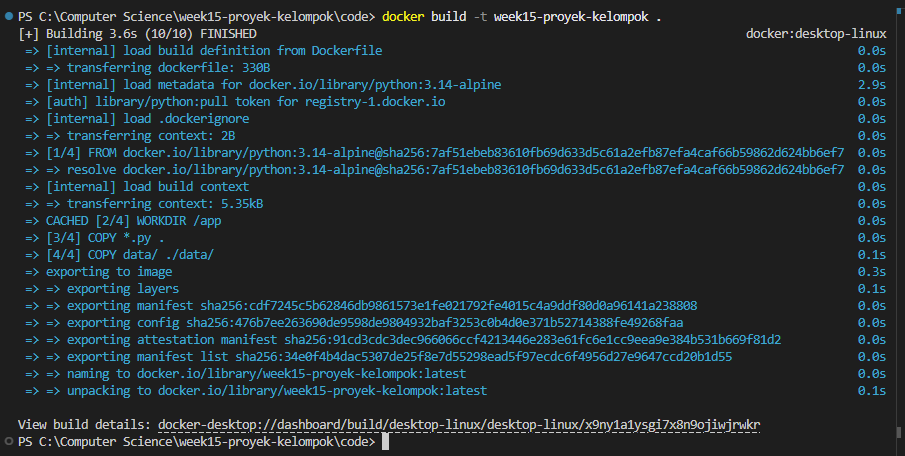
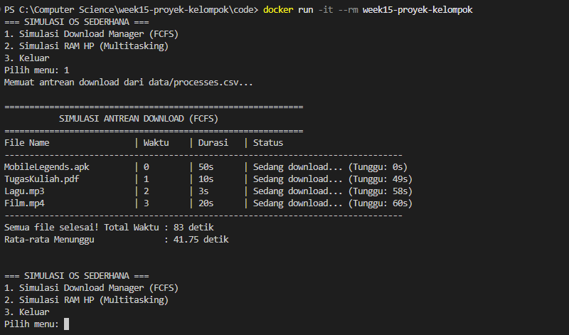
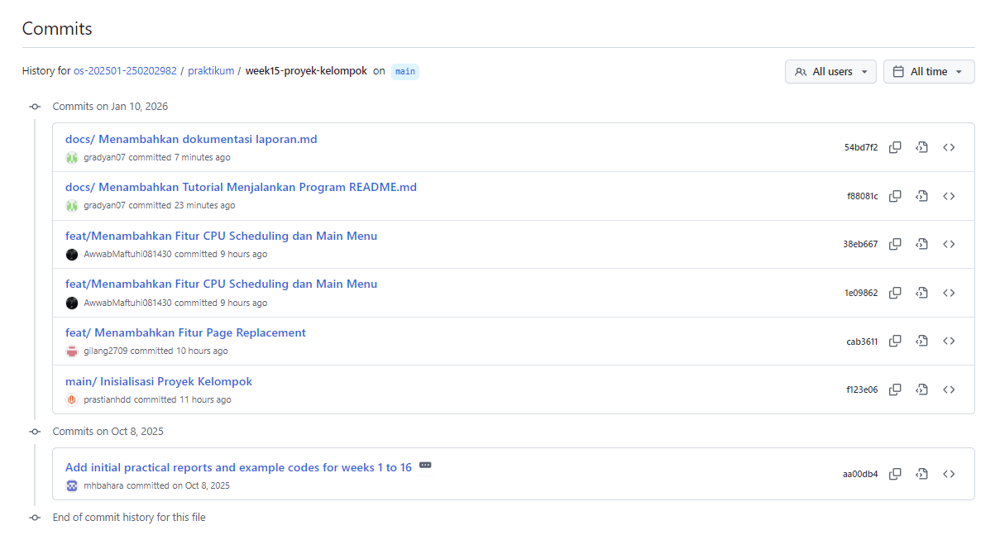

# Laporan Proyek Kelompok: Mini Simulasi Sistem Operasi

## 1. Pendahuluan

### A. Latar Belakang
Sistem operasi merupakan perangkat lunak sistem yang bertugas mengelola sumber daya perangkat keras dan perangkat lunak, serta bertindak sebagai perantara antara pengguna dan perangkat keras komputer. Konsep-konsep inti di dalamnya, seperti penjadwalan proses (*CPU Scheduling*) dan manajemen memori (*Memory Management*), sering kali bersifat abstrak dan sulit dipahami tanpa visualisasi yang konkret. Oleh karena itu, diperlukan sebuah pendekatan praktis untuk mendemonstrasikan bagaimana sistem operasi bekerja dalam menangani tugas-tugas tersebut.

Proyek ini, yang bertajuk "Mini Simulasi Sistem Operasi", dikembangkan untuk mengintegrasikan materi praktikum menjadi sebuah aplikasi berbasis terminal yang fungsional. Aplikasi ini dirancang untuk mensimulasikan logika sistem operasi melalui analogi kegiatan sehari-hari agar lebih mudah dipahami. Kami mengimplementasikan dua modul utama:
1.  **Simulasi Download Manager**, yang merepresentasikan algoritma *CPU Scheduling* tipe *First-Come First-Served* (FCFS). Dalam simulasi ini, berkas yang diklik pertama kali akan diproses (diunduh) hingga selesai sebelum sistem beralih ke berkas berikutnya.
2.  **Simulasi RAM HP**, yang memodelkan algoritma *Page Replacement* tipe FIFO (*First-In First-Out*). Simulasi ini menggambarkan manajemen memori pada ponsel pintar, di mana aplikasi yang paling lama dibuka akan ditutup secara otomatis oleh sistem ketika kapasitas memori (RAM) telah penuh dan pengguna membuka aplikasi baru.

Pengembangan aplikasi ini juga dilakukan untuk memenuhi standar rekayasa perangkat lunak modern, termasuk penggunaan *Docker* untuk memastikan lingkungan eksekusi yang konsisten (*reproducible environment*) dan penerapan alur kerja kolaboratif menggunakan *Git*.

### B Tujuan Proyek
Berdasarkan deskripsi tugas praktikum Minggu 15, tujuan utama dari pelaksanaan proyek ini adalah sebagai berikut:

1.  Mahasiswa mampu bekerja secara kolaboratif dalam tim dengan pembagian peran yang terstruktur (seperti *Project Lead*, *Developer*, dan *Documentation/QA*).
2.  Mahasiswa mampu mengimplementasikan dan menggabungkan minimal dua konsep sistem operasi (Penjadwalan CPU dan Manajemen Memori) ke dalam satu aplikasi terpadu.
3.  Mahasiswa mampu menerapkan pengelolaan kode sumber (*source control*) menggunakan Git, termasuk penggunaan teknik *branching* dan *merge request* yang rapi.
4.  Mahasiswa mampu membungkus aplikasi menggunakan Docker untuk mempermudah proses distribusi dan demonstrasi aplikasi di berbagai lingkungan sistem operasi.
5.  Mahasiswa mampu menyusun laporan teknis yang sistematis serta mempresentasikan hasil pengujian dan analisis kinerja aplikasi secara komprehensif.

---

## 2. Arsitektur Aplikasi

### A. Desain Arsitektur Umum
Aplikasi "Mini Simulasi Sistem Operasi" ini dibangun menggunakan arsitektur modular berbasis **Command Line Interface (CLI)** dengan bahasa pemrograman Python. Struktur aplikasi dirancang secara terpisah antara logika utama program (*main controller*) dan logika algoritma simulasi (*business logic*) untuk memudahkan pemeliharaan dan pengembangan kode.

Secara garis besar, arsitektur aplikasi terdiri dari tiga komponen utama:
1.  **Controller Utama (`main.py`):** Bertindak sebagai pintu masuk (*entry point*) aplikasi yang menangani interaksi pengguna, menampilkan menu pilihan, dan memanggil fungsi dari modul yang relevan.
2.  **Modul Logika (*Logic Modules*):** Berkas terpisah yang berisi implementasi algoritma sistem operasi, yaitu `cpu_scheduling.py` untuk penjadwalan CPU dan `page_replacement.py` untuk manajemen memori.
3.  **Manajemen Data (*Data Layer*):** Penyimpanan data input statis dalam bentuk berkas teks (`.csv` dan `.txt`) yang terletak di direktori `data/` untuk dibaca oleh modul logika.

Seluruh komponen ini dibungkus dalam **Docker container** untuk menjamin aplikasi dapat berjalan secara konsisten di berbagai lingkungan sistem operasi tanpa hambatan dependensi.

### B. Deskripsi Modul
Aplikasi ini mengintegrasikan dua modul utama yang mensimulasikan fungsi inti sistem operasi:

#### 1. Modul CPU Scheduling (Download Manager)
Modul ini mensimulasikan algoritma penjadwalan proses **First-Come First-Served (FCFS)** dengan analogi sebuah antrean unduhan berkas.
* **Berkas Sumber:** `cpu_scheduling.py`
* **Input Data:** Berkas `processes.csv` yang memuat daftar nama berkas, waktu kedatangan (*Arrival Time*), dan durasi unduh (*Burst Time*).
* **Logika Proses:**
    1.  Sistem membaca data unduhan dan melakukan pengurutan (*sorting*) berdasarkan waktu kedatangan menggunakan algoritma *Bubble Sort*.
    2.  Sistem memproses antrean secara berurutan. Berkas yang tiba lebih awal akan diproses hingga selesai sebelum beralih ke berkas berikutnya (non-preemptive).
    3.  Sistem menghitung waktu tunggu (*waiting time*) untuk setiap berkas.
* **Output:** Tabel status unduhan yang menampilkan urutan eksekusi dan ringkasan rata-rata waktu tunggu.

#### 2. Modul Page Replacement (Simulasi RAM HP)
Modul ini mensimulasikan algoritma manajemen memori **FIFO (First-In First-Out)** dengan analogi manajemen aplikasi latar belakang (*background apps*) pada ponsel.
* **Berkas Sumber:** `page_replacement.py`
* **Input Data:**
    * Berkas `pages.txt` yang berisi urutan riwayat aplikasi yang dibuka pengguna.
    * Input pengguna secara langsung untuk menentukan kapasitas maksimal RAM (jumlah *frame*).
* **Logika Proses:**
    1.  Sistem membaca urutan aplikasi (representasi *page reference string*).
    2.  Setiap aplikasi yang dibuka akan dimuat ke dalam senarai `ram`.
    3.  Jika aplikasi sudah ada di RAM (*Hit*), posisi tidak berubah.
    4.  Jika aplikasi belum ada dan RAM penuh (*Miss/Page Fault*), sistem akan menghapus aplikasi yang paling awal masuk (indeks ke-0) untuk memberi ruang bagi aplikasi baru.
* **Output:** Tabel visualisasi isi RAM pada setiap langkah dan total jumlah aplikasi yang ditutup paksa (*Page Fault count*).

### C. Alur Data (Data Flow)
Aliran data dalam aplikasi berjalan secara sekuensial sebagai berikut:

1.  **Inisialisasi:** Pengguna menjalankan aplikasi melalui terminal (atau Docker). Program `main.py` memuat pustaka yang diperlukan.
2.  **Pemilihan Menu:** Pengguna memilih mode simulasi (1 untuk Scheduling, 2 untuk Memory) pada menu utama.
3.  **Pengambilan Input:**
    * Jika mode Scheduling dipilih, fungsi `load_download_data` membaca `data/processes.csv`.
    * Jika mode Memory dipilih, fungsi `load_ram_data` membaca `data/pages.txt` dan meminta input kapasitas RAM dari pengguna.
4.  **Pemrosesan:** Data yang telah dimuat dikirim ke fungsi simulasi terkait (`simulasi_download_fcfs` atau `simulasi_ram_hp`) untuk diproses sesuai algoritma masing-masing.
5.  **Penyajian Output:** Hasil perhitungan dan simulasi ditampilkan ke layar pengguna dalam format tabel yang terstruktur, diikuti dengan kembalinya program ke menu utama (loop).

---

## 3. Demo Langsung Menjalankan Aplikasi

Sesuai dengan ketentuan teknis proyek, kami telah menyusun panduan instalasi dan eksekusi lengkap pada berkas `code/README.md` yang disertakan dalam repositori ini. Demo aplikasi dapat dilakukan melalui dua metode, namun kami merekomendasikan penggunaan **Docker** untuk hasil yang paling stabil.

### 3.1 Lingkungan Demo (Environment)
Demo aplikasi ini dijalankan pada lingkungan terisolasi menggunakan **Docker Container**.
* **Base Image:** `python:3.14-alpine` (Dipilih karena ukurannya yang ringan dan efisien).
* **Struktur Container:** Menyalin seluruh kode sumber (`.py`) dan folder dataset (`data/`) ke dalam direktori kerja `/app` di dalam container.

### 3.2 Prosedur Demo
Berikut adalah ringkasan prosedur demo yang dilakukan untuk memverifikasi fungsionalitas aplikasi. Petunjuk teknis baris-per-baris (*step-by-step commands*) dapat dilihat pada lampiran `code/README.md`.

1.  **Tahap Build Image**
    Kami membangun citra Docker (*docker image*) bernama `week15-proyek-kelompok`. Proses ini memastikan seluruh dependensi dan struktur folder tersusun dengan benar sesuai konfigurasi `Dockerfile`.

    

    
    

2.  **Tahap Eksekusi (Run)**
    Container dijalankan dalam mode interaktif (`-it`) untuk memungkinkan pengguna berinteraksi dengan menu CLI aplikasi. Mode `--rm` diaktifkan agar container otomatis dibersihkan setelah demo selesai, menjaga kebersihan *resource* sistem host.

3.  **Tahap Interaksi Pengguna**
    Saat aplikasi berjalan, demo mencakup tiga skenario utama:
    * **Skenario 1 (Scheduling):** Memilih menu "1" untuk memuat `processes.csv` dan menampilkan simulasi antrean unduhan FCFS.
    * **Skenario 2 (Memory):** Memilih menu "2" untuk memuat `pages.txt`, memasukkan input kapasitas RAM (contoh: 3 frame), dan mengamati simulasi penggantian halaman FIFO.
    * **Skenario 3 (Terminasi):** Memilih menu "3" untuk keluar dari program secara aman.

### 3.3 Bukti Eksekusi
Tangkapan layar (*screenshot*) hasil eksekusi program, baik tampilan menu utama maupun hasil tabel perhitungan, telah kami lampirkan dalam folder `screenshots/` sebagai bukti validasi bahwa aplikasi berjalan sesuai spesifikasi.

---

## 4. Hasil Pengujian dan Analisis

Pada bagian ini, kami menyajikan hasil eksekusi aplikasi menggunakan dataset standar yang telah disiapkan. Pengujian dilakukan untuk memverifikasi kebenaran logika algoritma *CPU Scheduling* dan *Page Replacement*.

### A Hasil Pengujian Modul A (CPU Scheduling - FCFS)

**Skenario Pengujian:**
Kami menggunakan dataset antrean unduhan (`processes.csv`) dengan data sebagai berikut:
1.  **MobileLegends.apk** (Waktu Klik: 0, Durasi: 50s)
2.  **TugasKuliah.pdf** (Waktu Klik: 1, Durasi: 10s)
3.  **Lagu.mp3** (Waktu Klik: 2, Durasi: 3s)
4.  **Film.mp4** (Waktu Klik: 3, Durasi: 20s)

**Hasil Output Aplikasi:**

Berikut adalah screnshoots hasil simulasi yang dihasilkan:

  

---

Berikut adalah tabel hasil simulasi yang dihasilkan oleh aplikasi:

| File Name          | Waktu | Durasi   | Waiting Time (Tunggu) |
|--------------------|-------|----------|-----------------------|
| MobileLegends.apk  | 0     | 50s      | 0 detik               |
| TugasKuliah.pdf    | 1     | 10s      | 49 detik              |
| Lagu.mp3           | 2     | 3s       | 58 detik              |
| Film.mp4           | 3     | 20s      | 60 detik              |
| **Total Waktu** |       |          | **83 detik** |
| **Rata-rata** |       |          | **41.75 detik** |

**Analisis Kinerja:**

Berdasarkan hasil di atas, terlihat kelemahan utama algoritma *First-Come First-Served* (FCFS), yaitu fenomena **Convoy Effect**.
* Berkas besar (`MobileLegends.apk`) yang datang di awal menyebabkan berkas-berkas kecil di belakangnya (`TugasKuliah.pdf` dan `Lagu.mp3`) harus menunggu sangat lama.
* `Lagu.mp3` yang hanya membutuhkan 3 detik untuk diunduh terpaksa menunggu selama 58 detik. Hal ini menunjukkan bahwa FCFS tidak efisien untuk meminimalkan *average waiting time* jika terdapat variasi *burst time* yang besar.

---

### B Hasil Pengujian Modul B (Page Replacement - FIFO)

**Skenario Pengujian:**

Kami mensimulasikan manajemen RAM HP menggunakan dataset riwayat aplikasi (`pages.txt`) dengan urutan akses:
`WhatsApp, Discord, YouTube, Mobile Legend, WhatsApp, Discord, Instagram, YouTube`.
Kapasitas RAM diset menjadi **3 Aplikasi** (*frames*).

**Hasil Output Aplikasi:**

Berikut adalah screnshoots hasil simulasi yang dihasilkan:

  

---

Tabel berikut menggambarkan perubahan isi RAM pada setiap langkah (Tanda **(X)** menunjukkan terjadinya *Page Fault* atau aplikasi ditutup paksa):

| Langkah | Aplikasi Buka | Isi RAM (FIFO)               | Status             |
|:-------:|:-------------:|:-----------------------------|:-------------------|
| 1       | WhatsApp      | [WhatsApp]                   | Loading Baru...    |
| 2       | Discord       | [WhatsApp, Discord]          | Loading Baru...    |
| 3       | YouTube       | [WhatsApp, Discord, YouTube] | Loading Baru...    |
| 4       | Mobile Legend | [Discord, YouTube, ML]       | **PENUH! Tutup WhatsApp** |
| 5       | WhatsApp      | [YouTube, ML, WhatsApp]      | **PENUH! Tutup Discord** |
| 6       | Discord       | [ML, WhatsApp, Discord]      | **PENUH! Tutup YouTube** |
| 7       | Instagram     | [WhatsApp, Discord, IG]      | **PENUH! Tutup ML** |
| 8       | YouTube       | [Discord, IG, YouTube]       | **PENUH! Tutup WhatsApp** |

**Metrik Akhir:**
* Total Aplikasi (Reference String): 8
* Total Page Fault (Tutup Paksa + Load Awal): **8 kali**

**Analisis Kinerja:**
Algoritma FIFO (*First-In First-Out*) bekerja secara murni berdasarkan waktu kedatangan tanpa mempertimbangkan frekuensi penggunaan.
* Pada langkah ke-4, `WhatsApp` dihapus karena merupakan aplikasi terlama di memori, padahal `WhatsApp` segera diakses kembali pada langkah ke-5.
* Hal ini menyebabkan terjadinya *Page Fault* berulang untuk aplikasi yang sama. Ini menunjukkan bahwa FIFO belum tentu optimal untuk pola penggunaan aplikasi yang repetitif (berulang-ulang) dibandingkan algoritma lain seperti LRU (*Least Recently Used*).

---

## 5. Pembagian Peran dan Kontribusi

Proyek ini dikerjakan secara kolaboratif dengan pembagian tugas yang jelas untuk memastikan setiap modul dapat diselesaikan tepat waktu dan terintegrasi dengan baik. Berikut adalah rincian peran dan kontribusi setiap anggota tim:

  

### Keterangan
| Nama Anggota | Peran Utama | Deskripsi Kontribusi |
| :--- | :--- | :--- |
| **Prastian Hidayat** | *Project Lead & Integrator* | • Merancang struktur awal proyek dan `main.py`. • Mengelola repositori Git (merge PR, resolve conflict). • Membuat konfigurasi `Dockerfile` agar aplikasi berjalan di container. • Melakukan pengujian fungsional seluruh modul. • Mengumpulkan *screenshot* bukti demo.|
| **Awwab Maftuhi** | *Developer (Modul Scheduling)* | • Mengimplementasikan algoritma FCFS pada `cpu_scheduling.py`. • Menyusun logika *sorting* data berdasarkan waktu kedatangan. • Membuat dataset `processes.csv`. |
| **Fatkhurrohman Gilang Ramadhan** | *Developer (Modul Memory)* | • Mengimplementasikan algoritma FIFO pada `page_replacement.py`. • Membuat visualisasi tabel isi RAM. • Menyusun dataset `pages.txt` dan skenario uji *page fault*. |
| **Gradyan Alannahda Shofari** | *Documentation & QA* | • Menyusun file `README.md` dan dokumentasi cara penggunaan. • Menyusun file dokumen akhir `laporan.md` |

---

## 6. Jawaban Quiz & Penutup

Sebagai bagian dari evaluasi pemahaman, berikut adalah jawaban atas pertanyaan quiz terkait pengembangan proyek ini.

### 6.1 Jawaban Quiz

**1. Tantangan terbesar integrasi modul apa, dan bagaimana solusinya?**
  * **Tantangan:** Menggabungkan dua modul yang bekerja dengan tipe data berbeda (CSV untuk scheduling dan TXT untuk memori) ke dalam satu alur eksekusi di `main.py` tanpa mengganggu logika masing-masing. Selain itu, memastikan *path* file dataset terbaca dengan benar baik saat dijalankan di Windows/Linux maupun di dalam Docker container.
  * **Solusi:** Kami melakukan modularisasi fungsi secara ketat. Fungsi baca file (`load_data`) dipisahkan dari fungsi logika simulasi. Di `main.py`, kami menggunakan percabangan menu sederhana yang memanggil fungsi utama dari tiap modul (`simulasi_download_fcfs` atau `simulasi_ram_hp`) sehingga variabel antar modul tidak saling menimpa.

**2. Mengapa Docker membantu proses demo dan penilaian proyek?**
  * Docker menciptakan lingkungan yang terisolasi dan konsisten (*reproducible environment*).
  * Masalah klasik *"It works on my machine"* dapat dihindari karena asisten/dosen penilai tidak perlu menginstall dependensi Python atau memikirkan versi OS yang berbeda. Cukup dengan perintah `docker run`, aplikasi dijamin berjalan sama persis seperti saat kami mengembangkannya.

**3. Jika dataset diperbesar 10x, modul mana yang paling terdampak performanya? Jelaskan.**
  * **Jawaban:** Modul **CPU Scheduling**.
  * **Analisis:** Pada modul CPU Scheduling, terdapat proses pengurutan (*sorting*) data berdasarkan waktu kedatangan yang menggunakan algoritma **Bubble Sort**. Kompleksitas waktu Bubble Sort adalah $O(n^2)$.
  * Jika data diperbesar 10x, beban komputasi sorting akan meningkat secara kuadratik (sekitar 100x lebih berat).
  * Sebaliknya, modul Page Replacement (FIFO) memiliki kompleksitas linear $O(n)$ (atau $O(n \times m)$ di mana $m$ kapasitas RAM yang kecil). Peningkatan data 10x pada modul memori "hanya" akan memperpanjang waktu eksekusi sekitar 10x lipat (linear), sehingga dampaknya tidak separah modul Scheduling.

### 6.2 Kesimpulan
Proyek "Mini Simulasi Sistem Operasi" ini berhasil mendemonstrasikan logika dasar sistem operasi melalui pendekatan simulasi sederhana.
1.  **Integrasi:** Berhasil menggabungkan algoritma FCFS dan FIFO dalam satu aplikasi CLI.
2.  **DevOps:** Penerapan Docker dan Git membuktikan kesiapan tim dalam praktik pengembangan perangkat lunak modern.
3.  **Pemahaman:** Simulasi ini memperjelas konsep abstrak seperti *waiting time* dan *page fault* melalui visualisasi data konkret.