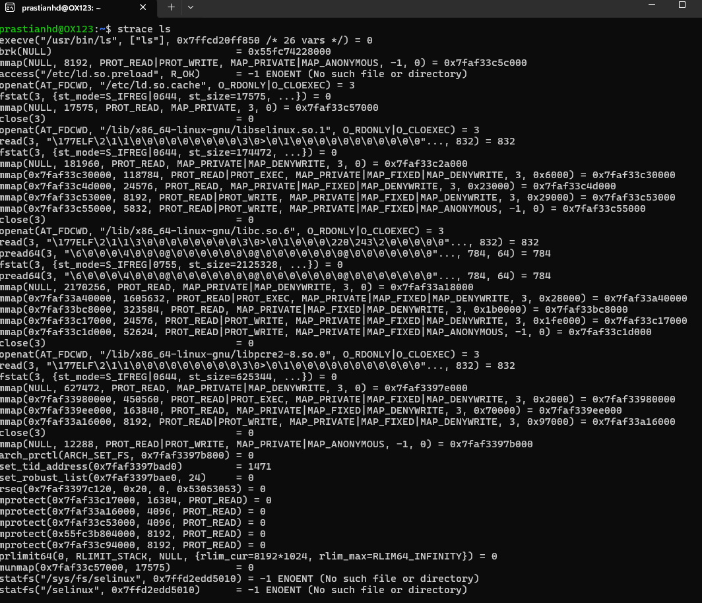
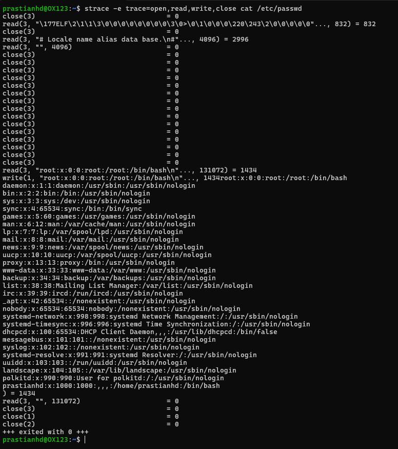
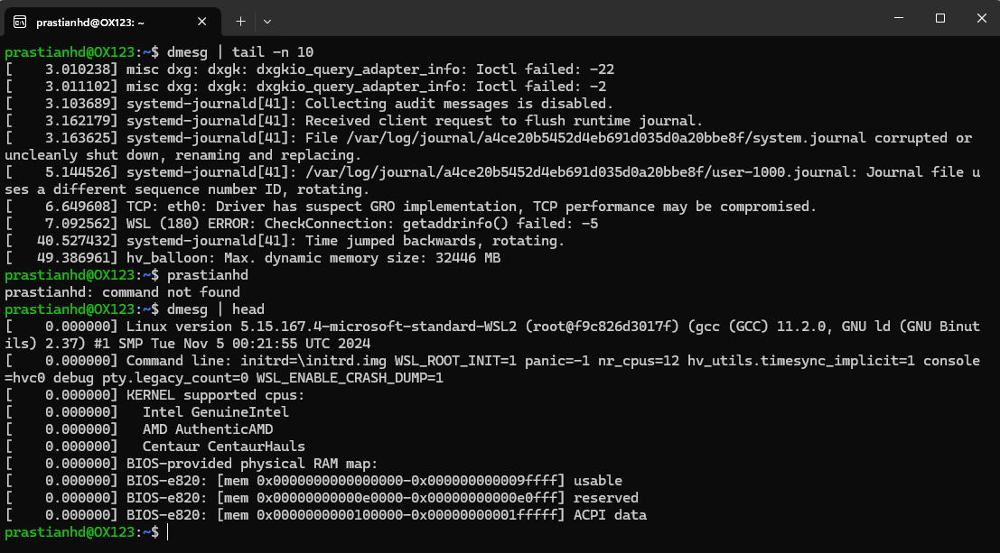

# Laporan Praktikum Minggu 2

### Topik : Struktur System Call dan Fungsi Kernel

-----

## Identitas

  - **Nama** : Prastian Hidayat
  - **NIM** : 250202982
  - **Kelas** : 1IKRB2

-----

## Tujuan

1.  Mahasiswa mampu menjelaskan konsep dan fungsi system call dalam sistem operasi.
2.  Mahasiswa mampu mengidentifikasi jenis-jenis system call beserta fungsinya.
3.  Mahasiswa mampu mengamati alur perpindahan dari *user mode* ke *kernel mode* saat system call terjadi.
4.  Mahasiswa mampu menggunakan perintah `strace` di Linux untuk menampilkan dan menganalisis system call yang dihasilkan oleh sebuah program.

-----

## Dasar Teori

System call menyediakan interface antara program pengguna yang berjalan dan bagian *Operating System* . System call menjadi jembatan antara proses dan sistem operasi. Karena aplikasi tidak diizinkan mengakses perangkat keras secara langsung demi keamanan dan stabilitas, mereka harus meminta layanan dari kernel untuk melakukan operasi-operasi penting seperti membaca file, membuat proses baru, atau berkomunikasi melalui jaringan. Setiap permintaan ini dieksekusi melalui system call, yang memicu transisi terkontrol dari *user mode* ke *kernel mode*, di mana kernel dapat menjalankan tugas tersebut atas nama aplikasi secara aman.

-----

## Langkah Praktikum

1.  Mempelajari materi minggu 2 tentang struktur system call dan fungsi kernel.
2.  Memastikan lingkungan Linux (WSL/Ubuntu) telah siap 
3.  Melakukan Install `strace` dan `man` dengan menjalankan perintah :
    ```bash
    sudo apt update 
    sudo apt upgrade -y
    sudo apt install strace
    sudo apt install man
    ```
4.  Melakukan **Eksperimen 1** dengan menjalankan `strace ls` untuk mengamati system call yang digunakan oleh perintah `ls`.
    * Screenshot hasil outputnya dan letakan di folder `week2-syscall-structures/screenshots/` dengan nama `syscal_ls.png`
    * Salin hasil outputnya juga kemudian letakan di folder `week2-syscall-structures/result/` dengan nama `syscall_ls.txt`
5.  Melakukan **Eksperimen 2** dengan menjalankan `strace -e trace=open,read,write,close cat /etc/passwd` untuk fokus menganalisis system call terkait operasi file I/O.
    * Screenshot hasil outputnya dan letakan di folder `week2-syscall-structures/screenshots/` dengan nama `strace_io.png`
    * Salin hasil outputnya juga kemudian letakan di folder `week2-syscall-structures/result/` dengan nama `strace_io.txt`
6.  Melakukan **Eksperimen 3** dengan menjalankan `dmesg | tail -n 10` untuk mengamati pesan-pesan dari kernel dan membedakannya dengan output program biasa.
    * Screenshot hasil outputnya dan letakan di folder `week2-syscall-structures/screenshots/` dengan nama `dmesg_10.png`
    * Salin hasil outputnya juga kemudian letakan di folder `week2-syscall-structures/result/` dengan nama `dmesg_10.txt`
7.  Membuat diagram alur yang menggambarkan proses eksekusi system call.
    * Screenshot atau download diagram kemudian letakan ke folder `week2-syscall-structures/screenshots/`
8.  Melakukan *commit* dan *push* seluruh hasil praktikum minggu 2 ini dengan pesan commit di bawah :
    ```
    // Menambahkan semua perubahan untuk di commit
    git add .

    // Membuat catatan commit dengan pesan dari format yang telah di atur
    git commit -m "Minggu 2 - Struktur System Call dan Kernel Interaction"

    // Push hasil commit ke repositori GitHub
    git push origin main
    ```
-----

## Kode / Perintah

```bash
strace ls
```

```bash
strace -e trace=open,read,write,close cat /etc/passwd
```

```bash
dmesg | tail -n 10
```

-----

## Hasil Eksekusi

### Eksperimen 1 – Analisis System Call `ls`


**Tabel Observasi `strace ls`**

| System Call | Keterangan |
| :--- | :--- |
| `execve()` | Mengeksekusi program `/usr/bin/ls`. Ini adalah system call pertama yang memulai proses `ls`. |
| `brk()` | Mengelola alokasi memori untuk *data segment* program. |
| `access()` | Memeriksa apakah file atau direktori tersedia dan dapat diakses. |
| `openat()` | Membuka file-file library (`.so`) yang dibutuhkan oleh `ls`. |
| `fstat()` | Mendapatkan informasi tentang sebuah file yang sudah dibuka, seperti ukuran, izin akses, dll. |
| `mmap()` | Memetakan isi file ke dalam ruang memori proses. |
| `close()` | Menutup file descriptor yang sudah tidak digunakan lagi. |
| `rseq()` | Mengatur dan mendaftarkan *restartable sequences*, sebuah mekanisme untuk operasi atomik di user space. |
| `mprotect()` | Mengubah proteksi akses pada area memori tertentu (misalnya, dari *write* menjadi *read-only*). |
| `exit_group()` | Menghentikan semua proses program dan mengembalikan kode exit.

-----

### Eksperimen 2 – Analisis System Call File I/O


**Tabel Observasi `strace -e trace=open,read,write,close cat /etc/passwd`**
| System Call | Keterangan |
| :--- | :--- |
| `openat(AT_FDCWD, "/etc/passwd", O_RDONLY)` | Kernel membuka file `/etc/passwd` dalam mode *read only*. |
| `read(3)` | Kernel membaca konten dari file descriptor (yaitu `/etc/passwd`) ke dalam sebuah buffer. Proses pembacaan ini menghasilkan 1434 byte data. |
| `write(1, "root:x:0:0:root:/root:/bin/bash\n...", 1434)` | Kernel menulis 1434 byte data yang telah dibaca tadi ke file root |
| `close(3)` |  Kernel menutup semua program yang terkait dengan file `/etc/passwd`. |

-----

### Eksperimen 3 – Mode User vs Kernel


Perbedaan utama antara output `dmesg | tail -n 10` dengan output program biasa `dmesg | head`

| Kernel Call | Sub Call | Keterangan |
| :--- | :--- | :--- |
| `dmesg` | `tail -n 10` | Perintah tersebut menampilkan 10 pesan terakhir atau kejadian terbaru yang dicatat oleh kernel karena **tail** adalah perintah untuk melihat bagian paling bawah atau akhir dari sebuah output.  |
| `dmesg` | `head` | Perintah tersebut menampilkan 10 pesan-pesan pertama yang dicatat oleh kernel saat komputer baru mulai menyala  atau *proses booting* karena **head** adalah perintah untuk melihat bagian paling atas atau awal dari sebuah output. |

-----

## Analisis

Sistem operasi (OS) berfungsi sebagai penghubung antara pengguna dan perangkat keras komputer, dengan salah satu tugas utamanya adalah mengatur dan mengawasi penggunaan sumber daya. Untuk menjalankan fungsi ini secara aman dan teratur, OS mengimplementasikan mekanisme fundamental yang disebut system call. System call adalah jembatan yang menyediakan antarmuka antara program yang sedang berjalan (proses) dan inti dari sistem operasi itu sendiri. Pentingnya mekanisme ini tidak hanya terletak pada fungsionalitas, tetapi juga sebagai pilar utama keamanan dan proteksi sistem **(Watrianthos, 2018, hlm. 7).**

**Mengapa System Call Penting untuk Keamanan OS?**
Keamanan sebuah OS sangat bergantung pada kemampuannya untuk mengontrol akses ke sumber daya sistem. Program pengguna tidak diizinkan untuk berinteraksi langsung dengan perangkat keras seperti disk atau memori secara sembarangan, karena hal ini dapat menyebabkan kerusakan sistem, inkonsistensi data, atau pelanggaran privasi antar proses. Di sinilah system call memainkan peran krusialnya sebagai "penjaga gerbang".

Setiap kali sebuah program pengguna perlu melakukan operasi yang memerlukan hak istimewa—seperti membaca berkas atau membuat proses baru—ia harus meminta OS untuk melakukannya melalui system call. Dengan memusatkan semua permintaan ini, OS dapat menjalankan fungsi proteksinya dengan efektif. **Menurut Watrianthos (2018, hlm. 20)**, mekanisme proteksi ini harus dapat membedakan antara penggunaan yang diizinkan dan yang tidak, sehingga permintaan ilegal akan ditolak. Hal ini sejalan dengan fungsi OS sebagai program pengendali untuk menghindari kekeliruan (error) dan memastikan program jahat tidak dapat melewati batasan keamanan.

Bagaimana OS Memastikan Transisi User–Kernel Berjalan Aman?
Sistem operasi modern memisahkan operasinya ke dalam lapisan-lapisan logis, dengan kernel sebagai inti yang memiliki kontrol penuh. Program pengguna berjalan di lapisan luar dengan hak akses terbatas, sementara kernel berjalan di lapisan dalam yang terlindungi. Satu-satunya cara yang sah bagi program pengguna untuk masuk ke mode kernel adalah melalui system call. Ketika dipicu, kernel akan mengambil alih kontrol, memvalidasi semua parameter dari pengguna, dan menjalankan tugasnya. Setelah selesai, kernel mengembalikan hasilnya dan mentransfer kontrol kembali ke mode pengguna. Proses formal ini mencegah program pengguna mengeksekusi kode istimewa secara tidak sah atau mengganggu operasi inti OS (Watrianthos, 2018, hlm. 21).

Contoh System Call yang Sering Digunakan di Linux (Berdasarkan UNIX)
**Watrianthos (2018, hlm. 21)** memberikan beberapa contoh system call pada sistem operasi UNIX, yang menjadi dasar bagi Linux. Beberapa di antaranya adalah:

* `read` - Sebuah system call untuk operasi I/O, khususnya membaca data dari sebuah berkas. Parameter yang dibutuhkan biasanya adalah buffer (penyimpan data), ukuran maksimal data, dan identifikasi berkasnya.

* `write` - Serupa dengan read, system call ini digunakan untuk operasi I/O, tetapi fungsinya adalah untuk menulis data ke dalam sebuah berkas.
-----

## Kesimpulan

Dari praktikum ini, dapat ditarik beberapa kesimpulan:

1.  Perintah `strace` adalah alat diagnostik yang sangat ampuh untuk memvisualisasikan interaksi tak terlihat antara program aplikasi di *user mode* dan kernel OS melalui system call.
2.  Setiap perintah sederhana yang dijalankan di terminal, seperti `ls` atau `cat`, sebenarnya memicu serangkaian puluhan hingga ratusan system call untuk tugas-tugas seperti memuat library, mengalokasikan memori, dan melakukan operasi I/O.
3.  System call adalah mekanisme esensial yang tidak hanya menyediakan fungsionalitas, tetapi juga menegakkan keamanan dan stabilitas sistem dengan menjadi satu-satunya gerbang yang sah bagi aplikasi untuk mengakses sumber daya yang dikelola kernel.

-----

## Quiz

1.  **Apa fungsi utama system call dalam sistem operasi?**

    **Jawaban:**
    Fungsi utamanya adalah untuk menyediakan antarmuka yang aman dan terkontrol bagi program aplikasi (yang berjalan di *user mode*) untuk meminta layanan dari kernel sistem operasi (yang berjalan di *kernel mode*), seperti akses file, manajemen proses, dan komunikasi jaringan.

2.  **Sebutkan 4 kategori system call yang umum digunakan.**

    **Jawaban:**

      * **Manajemen Proses**: `fork()`, `execve()`, `exit()`, `wait()`
      * **Manajemen File**: `open()`, `read()`, `write()`, `close()`, `stat()`
      * **Manajemen Perangkat**: `ioctl()`, `read()`, `write()`
      * **Komunikasi**: `pipe()`, `socket()`, `connect()`

3.  **Mengapa system call tidak bisa dipanggil langsung oleh user program?**

    **Jawaban:**
    System call tidak bisa dipanggil langsung untuk alasan keamanan dan stabilitas. Jika program pengguna dapat memanggil fungsi kernel secara langsung, mereka akan melewati semua mekanisme perlindungan OS. Ini akan memungkinkan program apa pun untuk mengakses perangkat keras secara ilegal, merusak data kernel, atau mengganggu proses lain, yang pada akhirnya akan menyebabkan sistem crash atau celah keamanan. Pemanggilan harus melalui mekanisme *trap* yang terkontrol untuk memastikan kernel tetap memegang kendali penuh.

-----

## Refleksi Diri

  - **Apa bagian yang paling menantang minggu ini?**

      * Bagian yang paling menantang adalah memahami output dari `strace` pada awalnya. Terlihat sangat banyak dan teknis, sehingga sulit untuk mengidentifikasi mana system call yang paling penting dan apa sebenarnya fungsinya dalam konteks program yang sedang dijalankan.

  - **Bagaimana cara Anda mengatasinya?**

      * Saya mengatasinya dengan membaca manual (`man strace` dan `man 2 syscalls`) untuk memahami beberapa system call kunci seperti `execve`, `openat`, dan `mmap`. Selain itu, menggunakan opsi `-e trace=` seperti pada eksperimen kedua sangat membantu untuk memfokuskan analisis pada system call tertentu dan memahami alurnya secara lebih jelas.

-----

**Credit:** *Template laporan praktikum Sistem Operasi (SO-202501) – Universitas Putra Bangsa*