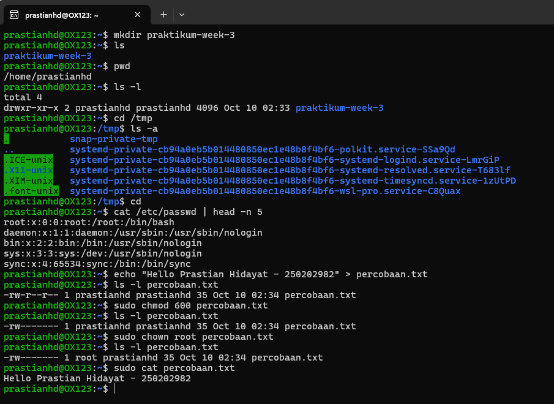

# Laporan Praktikum Minggu 3

### Topik : Manajemen File dan Permission di Linux

-----

## Identitas

  - **Nama** : Prastian Hidayat
  - **NIM** : 250202982
  - **Kelas** : 1IKRB

-----

## Tujuan

1.  Mahasiswa mampu menggunakan perintah `ls`, `pwd`, `cd`, `cat` untuk navigasi file dan direktori.
2.  Mahasiswa mampu menggunakan `chmod` dan `chown` untuk manajemen hak akses file.
3.  Mahasiswa mampu menjelaskan hasil output dari perintah Linux dasar tentang manajemen file dan permission file

-----

## Dasar Teori

Sistem file Linux adalah struktur hierarkis yang digunakan untuk mengelola file dan direktori. Setiap file dan direktori memiliki atribut penting yang disebut **permission (izin akses)** dan **ownership (kepemilikan)**. Konsep ini adalah pilar keamanan dasar dalam sistem operasi berbasis UNIX/Linux.

  - **Ownership**: Setiap file dimiliki oleh seorang **user (pengguna)** dan sebuah **group (kelompok)**. Ini menentukan siapa yang memiliki kontrol utama atas file tersebut.
  - **Permission**: Terdapat tiga jenis izin dasar yang dapat diberikan kepada pemilik, grup, dan pengguna lain (others):
      - **Read (`r`)**: Izin untuk membaca isi file atau melihat daftar isi direktori.
      - **Write (`w`)**: Izin untuk mengubah isi file atau membuat/menghapus file di dalam direktori.
      - **Execute (`x`)**: Izin untuk menjalankan file (jika itu adalah skrip atau program) atau masuk ke dalam direktori.

Perintah seperti `chmod` digunakan untuk mengubah izin akses ini, sementara `chown` digunakan untuk mengubah kepemilikan. Pengelolaan yang tepat atas atribut ini sangat penting untuk melindungi data dan menjaga stabilitas sistem.

-----

## Langkah Praktikum

1.  Mempersiapkan lingkungan Linux (Ubuntu/WSL).
2.  Melakukan **Eksperimen 1** untuk navigasi sistem file menggunakan `pwd`, `ls -l`, `cd /tmp`, dan `ls -a`.
3.  Melakukan **Eksperimen 2** untuk membaca isi file `/etc/passwd` menggunakan `cat` dan `head`.
4.  Melakukan **Eksperimen 3** untuk memanipulasi izin dan kepemilikan file menggunakan `echo`, `chmod`, dan `sudo chown`.
5.  Mengambil screenshot dari hasil eksperimen 1 sampai 3 dan menyimpannya di folder `screenshots/`.
6.  Mendokumentasikan seluruh hasil dan analisis dalam file `laporan.md`.
7.  Melakukan `commit` dan `push` hasil praktikum ke repositori GitHub dengan pesan commit yang sesuai.
```
    git add .
    git commit -m "Minggu 3 - Linux File System & Permission"
    git push -u origin main
```
-----

## Kode / Perintah

```bash
# Eksperimen 1
pwd
ls -l
cd /tmp
ls -a
```

```bash
# Eksperimen 2
cd
cat /etc/passwd | head -n 5
```

```bash
# Eksperimen 3
cd
echo "Hello Prastian Hidayat - 250202982" > percobaan.txt
ls -l percobaan.txt
chmod 600 percobaan.txt
ls -l percobaan.txt
sudo chown root percobaan.txt
ls -l percobaan.txt
sudo cat percobaan.txt
```

-----

## Hasil Eksekusi


### Eksperimen 1
| Perintah | Hasil Output | Keterangan |
| :--- | :--- | :--- |
| `mkdir praktikum-week-3` | (Tidak ada output) | Membuat folder `praktikum-week-3` |
| `ls` | `paktikum-week-3` | Menampilkan direktori yang ada |
| `pwd` | `/home/prastianhd` | Menampilkan direktori kerja saat ini, hasilnya direktori home dari user `prastianhd`. |
| `ls -l` | `drwxr-xr-x 2 prastianhd prastianhd 4096 Oct 10 02:33 praktikum-week-3` | Menampilkan isi direktori dengan format panjang. Terlihat ada satu direktori bernama `praktikum-week-3` dan tanggal akses. |
| `cd /tmp` | (Tidak ada output) | Mengubah direktori aktif dari `/home/prastianhd` ke direktori `/tmp`. |
| `ls -a` | (Menampilkan daftar file `systemd-private-...`, `.ICE-unix`, dll.) | Menampilkan seluruh isi dari direktori `/tmp`, termasuk file-file service dan file tersembunyi. |

-----
### Eksperimen 2
**Tabel Observasi `cat /etc/passwd | head -n 5`**
```
prastianhd@OX123:/tmp$ cd
prastianhd@OX123:~$ cat /etc/passwd | head -n 5
root:x:0:0:root:/root:/bin/bash
daemon:x:1:1:daemon:/usr/sbin:/usr/sbin/nologin
bin:x:2:2:bin:/bin:/usr/sbin/nologin
sys:x:3:3:sys:/dev:/usr/sbin/nologin
sync:x:4:65534:sync:/bin:/bin/sync
```
| Perintah | Keterangan |
| :--- | :--- |
| `cd` | Mengembalikan directori awal ke `/home/prastianhd/` |
| `cat /etc/passwd` `head -n 5`  | Membaca dan menampilkan konten dari file `/etc/passwd`, yang berisi informasi akun pengguna sistem. karena ada `head -n 5` maka output hanya menampilkan 5 baris pertama dari output perintah `cat`, yang berisi user sistem seperti `root`, `daemon`, `bin`, `sys`, dan `sync`. |
* Sesuai screenshot, setiap baris memiliki format. Contoh pada baris pertama : `root:x:0:0:root:/root:/bin/bash` ini adalah `username:password:UID:GID:comment:home_directory:login_shell`.

-----

### Eksperimen 3 

```
prastianhd@OX123:~$ echo "Hello Prastian Hidayat - 250202982" > percobaan.txt
prastianhd@OX123:~$ ls -l percobaan.txt
-rw-r--r-- 1 prastianhd prastianhd 35 Oct 10 02:34 percobaan.txt
prastianhd@OX123:~$ sudo chmod 600 percobaan.txt
prastianhd@OX123:~$ ls -l percobaan.txt
-rw------- 1 prastianhd prastianhd 35 Oct 10 02:34 percobaan.txt
prastianhd@OX123:~$ sudo chown root percobaan.txt
prastianhd@OX123:~$ ls -l percobaan.txt
-rw------- 1 root prastianhd 35 Oct 10 02:34 percobaan.txt
prastianhd@OX123:~$ sudo cat percobaan.txt
Hello Prastian Hidayat - 250202982
```
---
> Langkah 1
```bash
echo "Hello Prastian Hidayat - 250202982" > percobaan.txt
```
* Output = (tidak ada output)
* Perintah ini artinya membuat pesan dengan format txt dengan tulisan "`Hello Prastian Hidayat - 250202982`" yang kemudian di masukan ke dalam file `percobaan.txt`
---
> Langkah 2
```bash
ls -l percobaan.txt
```
* Output = (`-rw-r--r-- 1 prastianhd prastianhd 35 Oct 10 02:34 percobaan.txt`)
* Perintah ini artiinya file dibuat dengan izin default. Mari kita perjelas

  | Kode Permission | Keterangan |
  | :--- | :--- |
  | `-` | Tipe file. Tanda `-` berarti ini adalah file biasa. |
  | `rw-` | Izin untuk pemilik . `r` adalah izin baca (*read*), `w` adalah izin tulis (*write*), dan `-` berarti tidak ada izin eksekusi (*execute*). |
  | `r--` | Izin untuk grup. `r` berarti anggota grup hanya bisa membaca, tidak bisa menulis atau mengeksekusi. |
  | `r--` | Izin untuk lainnya . `r` berarti semua pengguna lain di sistem hanya bisa membaca file ini. |
  | `prastianhd` | Ini adalah pemilik file dimana disini file nya adalah `percobaan.txt` |
---
> Langkah 3
```bash
sudo chmod 600 percobaan.txt
```
* Tidak ada output
* Perintah ini artinya mengubah izin file menjadi `600`, di mana hanya pemilik yang memiliki hak baca (*read*)  dan tulis (*write*). Grup dan lainnya tidak memiliki izin .
---
> Langkah 4
```bash
ls -l percobaan.txt
```
* Output = (`-rw------- 1 prastianhd prastianhd 35 Oct 10 02:34 percobaan.txt`)
* Perintah ini artiinya file dibuat dengan izin default. Mari kita perjelas

  | Kode Permission | Keterangan |
  | :--- | :--- |
  | `-` | Tipe file. Tanda `-` berarti ini adalah file biasa. |
  | `rw-` | Izin untuk **pemilik** (`prastianhd`). `r` artinya baca (*read*) dan `w` artinya tulis *(write*). Pemilik bisa membaca dan mengedit file ini. |
  | `---` | Izin untuk **grup**. Tanda `-` di ketiga posisi berarti tidak ada izin baca, tulis, atau eksekusi untuk anggota grup. |
  | `---` | Izin untuk **pengguna lain** (selain pemilik dan grup), tidak ada izin sama sekali untuk pengguna lain di sistem. |
---
> Langkah 5
```bash
sudo chown root percobaan.txt
```
* Tidak ada output
* Mengubah kepemilikan file dari pengguna `prastianhd` menjadi pengguna `root` menggunakan hak akses superuser.
---
> Langkah 6
```bash
ls -l percobaan.txt
```

* Output = (`-rw------- 1 root prastianhd 35 Oct 10 02:34 percobaan.txt`)
* Perintah ini artinya file 

  | Kode Permission | Keterangan |
  | :--- | :--- |
  | `-` | Tipe file. Tanda `-` berarti ini adalah file biasa. |
  | `rw-` | Izin untuk pemilik baru (root). r artinya baca (read), dan w artinya tulis (write). Pengguna root bisa membaca dan mengubah file ini. |
  | `---` | Izin untuk **grup** (`prastianhd`). Tidak ada izin sama sekali (baca, tulis, atau eksekusi). |
  | `---` | Izin untuk **pengguna lain** (selain pemilik dan grup), tidak ada izin sama sekali untuk pengguna lain di sistem. |
  | `root` | Pengguna dengan hak akses penuh, bisa membaca, menulis, menghapus file. |
---
> Langkah 7
```bash
sudo cat percobaan.txt
```
* Output = `Hello Prastian Hidayat - 250202982`
* `cat` adalah perintah untuk membuka dan melihat suatu file. Jadi dalam konteks ini adalah perintah ini untuk membuka dan melihat isi text dari file `percobaan.txt`.
---
-----

## Analisis

**Eksperimen 1** memperlihatkan cara penggunaan perintah dasar seperti `pwd`, `ls`, dan `cd` untuk berinteraksi dengan file atau folder sistem file. Perintah `ls` dengan opsi `-l` dan `-a` secara efisien menunjukkan metadata penting, termasuk file tersembunyi di dalam sistem.

**Eksperimen 2** menunjukkan cara mengakses file sistem, seperti `/etc/passwd`. File ini menggambarkan cara Linux menyimpan data pengguna, di mana setiap kolom dipisahkan oleh tanda titik dua (`:`) yang mewakili atribut seperti nama pengguna, UID (User ID), GID (Group ID), direktori rumah, dan shell bawaan.

**Eksperimen 3** merupakan bagian utama dari praktikum ini, yang menitikberatkan pada perlindungan file.

1. **`chmod`**: Command ini terbukti menjadi alat penting untuk mengatur akses. Dengan mengubah hak akses dari `rw-r--r--` menjadi `rw-------` (oktal `600`) pada file `percobaan.txt`, akses secara efektif hanya diperbolehkan untuk pemiliknya. Ini adalah keamanan yang diterapkan untuk menjaga file sensitif agar tidak dapat diakses atau diubah oleh pengguna lain.

2. **`chown`**: Perintah ini digunakan untuk kepemilikan berkas. Dengan menjadikan `root` sebagai pemilik file, tanggung jawab dan kendali atas file itu dipindahkan ke superuser. Dalam situasi nyata, ini biasanya digunakan untuk file konfigurasi atau log sistem yang hanya boleh diatur oleh administrator guna menjaga integritas sistem.

Kedua perintah tersebut, `chmod` dan `chown`, adalah dasar dari model keamanan discretionary access control di Linux, di mana pemilik file berhak menentukan siapa yang dapat mengakses filenya


-----

## Kesimpulan

Dari praktikum ini, dapat disimpulkan bahwa:

  * Navigasi dan manipulasi file di lingkungan Linux sangat bergantung pada perintah-perintah dasar seperti `ls`, `cd`, `pwd`, dan `cat`, yang masing-masing memiliki fungsi spesifik untuk berinteraksi dengan sistem file.
  * Keamanan file di Linux diatur secara ketat melalui mekanisme **permission** dan **ownership**. Perintah `chmod` berfungsi untuk mengubah hak akses (baca, tulis, eksekusi), sedangkan `chown` berfungsi untuk mengubah kepemilikan (user dan group).
  * Pemahaman dan penggunaan yang benar atas `chmod` dan `chown` sangat krusial untuk menjaga keamanan dan integritas data dalam sistem operasi multi-user seperti Linux.

-----

## Quiz

1.  **Apa fungsi dari perintah `chmod`?**

    **Jawaban:**
    `chmod` adalah singkatakn dari *change mode*. Fungsinya untuk mengubah izin akses / *permissions* sebuah file atau direktori. Perintah ini menentukan siapa saja yang boleh membaca (`r`), menulis (`w`), dan mengeksekusi (`x`) file tersebut, yang berlaku untuk pemilik file, grup, dan pengguna lainnya.

-----

2.  **Apa arti dari kode permission `rwxr-xr--`?**

    **Jawaban:**
    | Kode Perimission | Keterangan |
    | :--- | :--- |
    | `rwx` | Izin untuk Pemilik(*User*). Pemilik file memiliki izin penuh untuk membaca (*read*), menulis (*write*), dan mengeksekusi (*execute*) file tersebut. |
    | `r-x` | Izin untuk Grup. Pengguna yang termasuk dalam grup file ini dapat membaca (*read*) dan mengeksekusi (*execute*), tetapi tidak dapat menulis atau mengubah file. |
    | `r--` | Pengguna lain di luar pemilik dan grup hanya dapat membaca (*read*) file tersebut. |
-----

3.  **Jelaskan perbedaan antara `chown` dan `chmod`.**

    **Jawaban:**
    Perbedaannya terletak pada aspek keamanan yang mereka kontrol
      * `chown` *change owner* mengubah **siapa yang memiliki** file atau direktori. Perintah ini mengatur aspek kepemilikan (user dan group).
      * `chmod` *change mode* mengubah **apa yang dapat dilakukan** terhadap file atau direktori. Perintah ini mengatur aspek izin akses (baca, tulis, eksekusi).

-----

## Refleksi Diri

  - **Apa bagian yang paling menantang minggu ini?**
    Untuk melakukan praktek linux week 3 ini tentang membuat file dan mengatur akses atau permission sudah lumayan paham, tetapi untuk membuat laporan masih merasa bingung formatnya harus seperti apa, mulai dari format penulisan atau nama file yang di sesuaikan  bersama

  - **Bagaimana cara Anda mengatasinya?**
    Setelah mencoba praktek linux saya bertanya lagi ke internet untuk lebih memudahkan saya dalam pemahaman materi di week 3 ini

-----

**Credit:** *Template laporan praktikum Sistem Operasi (SO-202501) – Universitas Putra Bangsa*