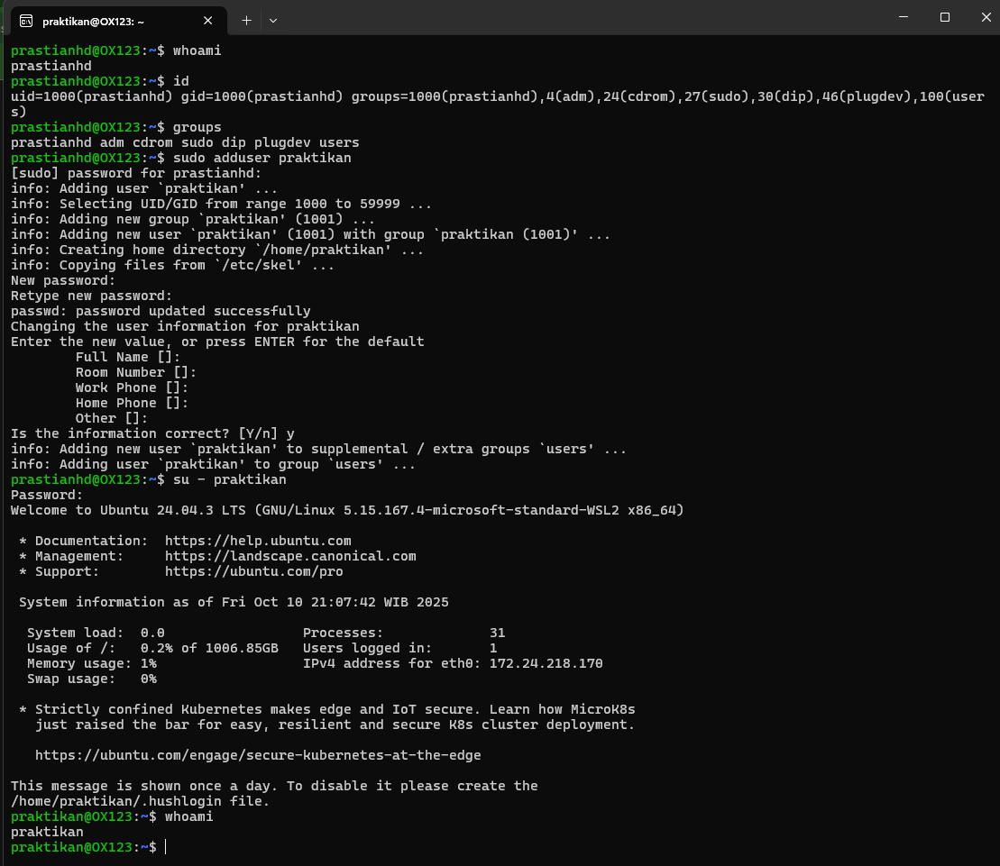
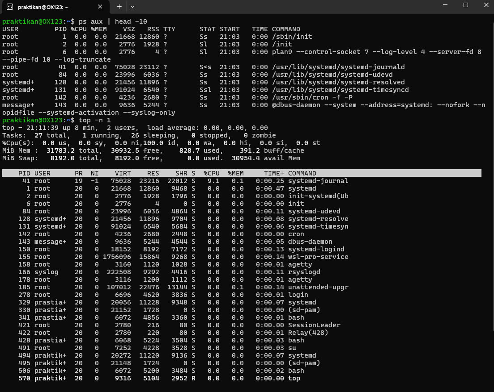

# Laporan Praktikum Minggu 4

### Topik : Manajemen Proses dan User di Linux

-----

## Identitas

  - **Nama** : Prastian Hidayat
  - **NIM** : 250202982
  - **Kelas** : 1IKRB

-----

## Tujuan

1.  Mahasiswa mampu menjelaskan konsep proses dan user dalam sistem operasi Linux.
2.  Mahasiswa mampu menampilkan daftar proses yang sedang berjalan dan statusnya.
3.  Mahasiswa mampu menggunakan perintah untuk membuat dan mengelola user.
4.  Mahasiswa mampu menghentikan atau mengontrol proses tertentu menggunakan PID.
5.  Mahasiswa mampu menjelaskan kaitan antara manajemen user dan keamanan sistem.

-----

## Dasar Teori

Dalam sistem operasi multi-user seperti Linux, **manajemen proses** dan **manajemen user** adalah dua konsep fundamental.

  - **Proses** adalah sebuah program yang sedang dieksekusi. Setiap kali Anda menjalankan perintah atau aplikasi, sistem operasi akan membuat satu atau lebih proses. Setiap proses memiliki ID unik yang disebut **Process ID (PID)**, informasi mengenai pengguna yang menjalankannya , serta sumber daya yang digunakannya . Proses induk *parent process* dapat membuat proses turunan *child process*, membentuk sebuah hierarki yang diawali oleh proses `init` atau `systemd` .

  - **Manajemen User** adalah cara sistem operasi mengelola siapa saja yang boleh mengakses sistem dan apa saja yang boleh mereka lakukan. Setiap pengguna memiliki **User ID (UID)** dan tergabung dalam satu atau lebih **Group (GID)**. Mekanisme ini, ditambah dengan hak akses file, menjadi fondasi keamanan sistem, memastikan bahwa pengguna hanya dapat mengakses data dan menjalankan proses yang diizinkan untuknya. Pengguna `root` adalah superuser yang memiliki hak akses tak terbatas ke seluruh sistem.

-----

## Langkah Praktikum

1.  Mempersiapkan lingkungan Linux (Ubuntu/WSL) 
2.  Melakukan **Eksperimen 1** untuk mengidentifikasi user yang sedang aktif menggunakan `whoami`, `id`, dan `groups`, kemudian screenshots hasilnya dan letakan di `screenshots/user.png`
3.  Melakukan **Eksperimen 2** untuk memonitor proses yang berjalan menggunakan `ps aux` dan `top`, kemudian screenshots hasilnya dan letakan di `screenshots/top.png`
4.  Melakukan **Eksperimen 3** untuk mengontrol proses dengan menjalankan `sleep` di latar belakang, mencari PID-nya, dan menghentikannya dengan `kill` , kemudian screenshots hasilnya dan letakan di `screenshots/sleep.png`
5.  Melakukan **Eksperimen 4** untuk menganalisis hierarki proses menggunakan `pstree`, kemudian screenshots hasilnya dan letakan di `screenshots/pstree.png`.
6.  Mendokumentasikan seluruh hasil dan analisis dalam file `laporan.md`.
7.  Melakukan `commit` dan `push` hasil praktikum ke repositori GitHub dengan pesan commit yang sesuai.
    ```
    git add .
    git commit -m "Minggu 4 - Manajemen Proses & User"
    git push origin main
    ```

-----

## Kode / Perintah

```bash
# Eksperimen 1
whoami
id
groups
sudo adduser praktikan 
su - praktikan
whoami
```

```bash
# Eksperimen 2
ps aux | head -10
top -n 1
```

```bash
# Eksperimen 3
sleep 1000 & ps aux | grep sleep
kill <PID>
ps aux | grep sleep
```

```bash
# Eksperimen 4
pstree -p | head -20
```

-----

## Hasil Eksekusi

### Eksperimen 1 – Identitas User



| Perintah | Hasil Output | Keterangan |
| :--- | :--- | :--- |
| `whoami` | `prastianhd` | Menampilkan username dari pengguna yang sedang login saat ini. |
| `id` | `uid=1000(prastianhd) gid=1000(prastianhd) groups=1000(prastianhd),4(adm),27(sudo)` | Menampilkan informasi detail tentang user, termasuk User ID (UID), Group ID (GID) utama, dan daftar grup lain di mana user tersebut menjadi anggota. |
| `groups` | `prastianhd adm sudo` | Menampilkan daftar grup tempat user `prastianhd` menjadi anggota. |
| `sudo adduser praktikan` | `adding user` | Menambahkan pengguna atau user dengan nama praktikan ke grup |
| `su - praktikan` | `praktikan@0x123` | Berpindah pengguna dari awal prastianhd menjadi praktikan |
| `whoami` | `praktikan` | Menampilkan username pengguna terbaru yakni praktikan | 

-----

### Eksperimen 2 – Monitoring Proses



**Penjelasan `ps aux` dan `top`**

| Kolom | Keterangan |
| :--- | :--- |
| `PID` | **Process ID**, nomor unik yang diberikan sistem operasi untuk setiap proses. |
| `USER` | **Pengguna** yang menjalankan proses tersebut. |
| `%CPU` | **Persentase penggunaan CPU** oleh proses. |
| `%MEM` | **Persentase penggunaan memori (RAM)** oleh proses. |
| `COMMAND`| **Perintah** atau nama program yang dieksekusi. |

* Perintah `ps aux | head -10` menampilkan snapshot dari 10 proses teratas yang sedang berjalan. Sementara `top -n 1` menampilkan daftar proses secara real-time 

-----

### Eksperimen 3 – Kontrol Proses

```
prastianhd@OX123:~$ sleep 1000 &
ps aux | grep sleep
[1] 454
prastia+     454  0.0  0.0   3124  1100 pts/0    S    08:10   0:00 sleep 1000
prastia+     456  0.0  0.0   4088  1944 pts/0    S+   08:10   0:00 grep --color=auto sleep
prastianhd@OX123:~$ kill 454
prastianhd@OX123:~$ ps aux | grep sleep
prastia+     458  0.0  0.0   4088  2028 pts/0    S+   08:10   0:00 grep --color=auto sleep
[1]+  Terminated              sleep 1000
```

1.  **`sleep 1000 &`**: Menjalankan perintah `sleep` selama 1000 detik di latar belakang (simbol `&`). Sistem memberikan output PID dari proses tersebut, yaitu `454`.
2.  **`ps aux | grep sleep`**: Mencari proses yang mengandung kata "sleep". Hasilnya menunjukkan proses `sleep 1000` dengan PID `454` sedang berjalan.
3.  **`kill 1234`**: Mengirimkan sinyal terminasi ke proses dengan PID `454`, sehingga proses tersebut berhenti dibuktikan dengan keterangan `Terminated`.
4.  Pengecekan ulang dengan `ps aux | grep sleep` menunjukkan bahwa proses `sleep` sudah tidak ada lagi, membuktikan bahwa perintah `kill` berhasil.

### Eksperimen 4 – Analisis Hierarki Proses

```
prastianhd@OX123:~$ pstree -p | head -20
systemd(1)─┬─accounts-daemon(849)─┬─{gdbus}(870)
           │                        └─{gmain}(852)
           ├─agetty(1115)
           ├─cron(825)
           ├─dbus-daemon(826)
           ├─login(1131)───bash(1201)───pstree(1350)
           ├─networkd-dispat(833)
           └─...
```

Perintah `pstree -p` menampilkan proses yang berjalan dalam format pohon, lengkap dengan PID-nya. Dari output di atas, terlihat bahwa `systemd` dengan PID `1` adalah proses induk dari hampir semua proses lain di sistem. Ini menunjukkan perannya sebagai manajer sistem dan layanan utama di Linux modern.

-----

## Analisis

1.  **Identitas User dan Proses**: Eksperimen 1 (`whoami`, `id`) menegaskan bahwa setiap tindakan di Linux terikat pada identitas pengguna tertentu. Eksperimen 2 (`ps`, `top`) menunjukkan bahwa setiap proses yang berjalan juga memiliki pemilik (`USER`), yang menghubungkan eksekusi program dengan hak akses pengguna.

2.  **Siklus Hidup Proses**: Eksperimen 3 adalah simulasi lengkap dari siklus hidup sebuah proses: diciptakan (`sleep 1000 &`), dimonitor (`ps aux`), dan dihentikan (`kill <PID>`). Ini membuktikan bahwa sistem operasi memberikan kontrol penuh kepada pengguna (terutama dengan hak akses yang cukup) untuk mengelola program yang mereka jalankan.

3.  **Hierarki Proses**: Eksperimen 4 (`pstree`) secara visual menggambarkan struktur ketergantungan antar proses. Semua proses berasal dari satu leluhur utama, yaitu `systemd` (atau `init` pada sistem yang lebih tua), yang bertanggung jawab untuk memulai dan mengelola semua layanan lain selama sistem berjalan.

Hubungan antara **manajemen user dan keamanan** sangat erat. Karena setiap proses dimiliki oleh seorang user, sistem operasi dapat menggunakan informasi ini untuk memberlakukan batasan keamanan. Seorang pengguna biasa tidak dapat menghentikan (`kill`) proses milik pengguna lain atau milik `root`, mencegah tindakan yang dapat merusak stabilitas sistem.

-----

## Kesimpulan

Dari praktikum ini, dapat disimpulkan bahwa:

  * Setiap pengguna di Linux memiliki identitas unik (UID, GID) yang menentukan hak aksesnya, yang dapat diverifikasi menggunakan perintah `id` dan `whoami`.
  * Semua program yang berjalan di Linux adalah proses yang dapat dimonitor status dan penggunaan sumber dayanya menggunakan `ps` dan `top`.
  * Linux menyediakan utilitas seperti `kill` untuk mengelola proses secara langsung dengan menargetkan **Process ID (PID)** unik milik proses tersebut.
  * Keamanan sistem Linux sangat bergantung pada model manajemen user, di mana hak akses pengguna membatasi proses apa yang bisa mereka jalankan dan kelola, sehingga melindungi sistem dari tindakan yang tidak sah.

-----

## Quiz

1.  **Apa fungsi dari proses `init` atau `systemd` dalam sistem Linux?**

    **Jawaban:**
    Proses `init` (pada sistem lama) atau `systemd` (pada sistem modern) adalah proses pertama yang dijalankan oleh kernel saat boot. Fungsinya adalah sebagai **induk dari semua proses** di sistem. Ia bertanggung jawab untuk memulai dan mengelola semua layanan (daemon) dan proses lain yang diperlukan agar sistem dapat berjalan, seperti layanan jaringan, antarmuka login, dan lainnya.

-----

2.  **Apa perbedaan antara `kill` dan `killall`?**

    **Jawaban:**
    Perbedaan utamanya terletak pada targetnya

      * **`kill`**: Menghentikan proses berdasarkan **Process ID (PID)**. Perintah ini hanya akan menargetkan satu proses spesifik. Contoh: `kill 454`.
      * **`killall`**: Menghentikan semua proses yang berjalan dengan **nama tertentu**. Perintah ini akan menghentikan semua proses yang cocok dengan nama tersebut. Contoh: `killall firefox` akan menutup semua jendela Firefox yang terbuka.

-----

3.  **Mengapa user `root` memiliki hak istimewa di sistem Linux?**

    **Jawaban:**
    User `root` (juga dikenal sebagai superuser) memiliki hak istimewa karena ia memiliki **UID 0**, yang secara desain oleh sistem operasi dibebaskan dari semua batasan hak akses. Ini memberikannya kemampuan untuk:

      * Mengakses, mengubah, dan menghapus file apa pun di sistem.
      * Mengelola proses milik pengguna mana pun.
      * Mengubah konfigurasi sistem secara keseluruhan.
      * Menginstal dan menghapus perangkat lunak.

    Hak istimewa ini diperlukan untuk tugas-tugas administrasi sistem yang tidak bisa dilakukan oleh pengguna biasa.

---

## Refleksi Diri
Tuliskan secara singkat:
- Apa bagian yang paling menantang minggu ini?
  tidak ada
- Bagaimana cara Anda mengatasinya?  

-----

**Credit:** *Template laporan praktikum Sistem Operasi (SO-202501) – Universitas Putra Bangsa*