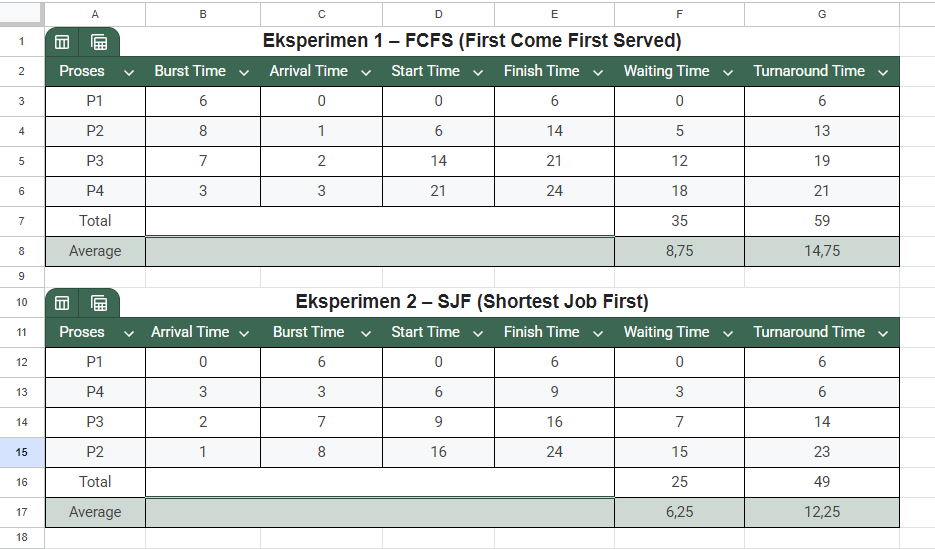

# Laporan Praktikum Minggu 5
Topik: Penjadwalan CPU FCFS dan SJF

---

## Identitas
- **Nama**  : Prastian Hidayat
- **NIM**   : 250202982 
- **Kelas** : 1IKRB

---

## Tujuan
1. Mampu menghitung waiting time dan turnaround time untuk algoritma FCFS dan SJF.
2. Mampu menyajikan hasil perhitungan dalam tabel yang rapi dan mudah dibaca.
3. Mampu membandingkan performa FCFS dan SJF berdasarkan hasil analisis.
4. Mampu menjelaskan kelebihan dan kekurangan masing-masing algoritma.
5. Mampu menyimpulkan kapan algoritma FCFS atau SJF lebih sesuai digunakan.
---

## Dasar Teori
Dalam sistem operasi multitasking, Penjadwalan CPU (CPU Scheduling) adalah proses fundamental di mana sistem operasi (OS) memutuskan proses mana di antrian 'ready' yang akan dialokasikan ke CPU. Tujuannya adalah untuk memaksimalkan penggunaan CPU dan throughput, serta meminimalkan waktu tunggu (waiting time) dan waktu penyelesaian (turnaround time) bagi pengguna.

* First Come First Served (FCFS): Ini adalah algoritma penjadwalan paling sederhana. Proses yang meminta CPU terlebih dahulu akan dilayani terlebih dahulu (sesuai urutan Arrival Time). Implementasinya mudah menggunakan antrian FIFO (First-In, First-Out), namun dapat menyebabkan convoy effect di mana proses singkat harus menunggu proses panjang yang datang lebih dulu.

* Shortest Job First (SJF): Algoritma ini mengalokasikan CPU ke proses dengan estimasi waktu eksekusi (Burst Time) terpendek. Jika ada dua proses dengan burst time yang sama, FCFS digunakan. SJF terbukti optimal dalam memberikan rata-rata waktu tunggu minimum, namun kelemahan utamanya adalah potensi terjadinya starvation pada proses yang memiliki burst time panjang.
---

## Langkah Praktikum
1. Mempersiapkan data proses (Contoh: P1, P2, P3, P4) dengan Burst Time dan Arrival Time yang ditentukan.

2. Mempersiapkan spreadsheet (Google Sheets/Excel) atau alat hitung manual.

3. Melakukan Eksperimen 1 untuk menghitung Waiting Time (WT) dan Turnaround Time (TAT) menggunakan algoritma FCFS.

4. Membuat Gantt Chart sederhana untuk visualisasi FCFS.

5. Melakukan Eksperimen 2 untuk menghitung WT dan TAT menggunakan algoritma SJF (non-preemptive).

6. Membuat tabel perbandingan untuk Average WT dan Average TAT dari kedua algoritma.

7. Menganalisis hasil perbandingan untuk menentukan kelebihan dan kekurangan masing-masing.

8. Mendokumentasikan seluruh hasil simulasi, perhitungan, dan analisis dalam file laporan.md.

9. Melakukan commit dan push hasil praktikum ke repositori GitHub.
   ```bash
   git add .
   git commit -m "Minggu 5 - CPU Scheduling FCFS & SJF"
   git push origin main
   ```

---

## Kode / Perintah
```bash
Waiting Time (WT) = Start Time - Arrival Time
Turnaround Time (TAT) = Finish Time - Arrival Time atau  Waiting Time + Burst Time

Average Waiting Time (WT) = Total Waiting Time / Jumlah Proses
Average Turnaround Time (TAT) = Total Turnaround Time / Jumlah Proses
```

---

## Hasil Eksekusi
Sertakan screenshot hasil percobaan atau diagram:

   

### Eksperimen 1 – FCFS (First Come First Served)
Proses dieksekusi berdasarkan urutan kedatangan (Arrival Time). Urutan Eksekusi: P1 -> P2 -> P3 -> P4

* Gantt Chart FCFS:
   ```
   | P1 | P2 | P3 | P4 |
   0    6    14   21   24
   ```

* Tabel Perhitungan FCFS:

   | Proses | Arrival Time | Burst Time | Start Time | Finish Time | Waiting Time | Turnaround Time |
   | :--- | :--- | :--- | :--- | :--- | :--- | :--- |
   | P1 | 0 | 6 | 0 | 6 | 0 | 6 |
   | P2 | 1 | 8 | 6 | 14 | 5 | 13 |
   | P2 | 2 | 7 | 14 | 21 | 12 | 19 |
   | P3 | 3 | 3 | 21 | 24 | 18 | 21 |
   | Total | | | | | 35 | 59 |
   | Average | | | | | 8,75 | 14,75 |

### Eksperimen 2 – SJF (Shortest Job First)
Proses dieksekusi berdasarkan Burst Time terpendek dari antrian proses yang telah tiba.

Urutan Eksekusi: P1 -> P4 -> P3 -> P2

* Gantt Chart FCFS:
   ```
   | P1 | P2 | P3 | P4 |
   0    6    9   16   24
   ```

* Tabel Perhitungan SJF:

   | Proses | Burst Time | Arrival Time | Start Time | Finish Time | Waiting Time | Turnaround Time |
   | :--- | :--- | :--- | :--- | :--- | :--- | :--- |
   | P1 | 0 | 6 | 0 | 6 | 0 | 6 |
   | P4 | 3 | 3 | 6 | 9 | 3 | 6 |
   | P3 | 2 | 7 | 9 | 16 | 7 | 14 |
   | P2 | 1 | 8 | 16 | 24 | 15 | 23 |
   | Total | | | | | 25 | 49 |
   | Average | | | | | 6,25 | 12,25 |
---

### Eksperimen 3 - Perbandingan FCFS & SJF

   | Algoritma | Avg Waiting Time | Avg Turnaround Time | Kelebihan | Kekurangan |
   | :--- | :--- | :--- | :--- | :--- |
   | FCFS | 8,75 | 14,75 | Sederhana dan mudah diterapkan | Tidak efisien untuk proses panjang |
   | SJF | 6,25 | 12,25	| Optimal untuk job pendek | Menyebabkan starvation pada job panjang |


---

## Analisis
Berdasarkan metrik evaluasi utama, SJF terbukti jauh lebih unggul dalam skenario pengujian ini. SJF berhasil mencapai Rata-rata Waktu Tunggu (Average Time) sebesar 6,25 dan Rata-rata Waktu Penyelesaian (Turnaround Time) sebesar 12,25. Angka ini menunjukkan peningkatan efisiensi yang substansial dibandingkan FCFS, yang mencatatkan Avg Time 8,75 dan Turnaround Time 14,75.

Kelemahan pada FCFS yaitu efek konvoi (convoy effect). Algoritma FCFS, yang beroperasi murni berdasarkan urutan kedatangan (P1 > P2 > P3 > P4), memaksa proses-proses singkat untuk menunggu di belakang proses-proses panjang yang kebetulan tiba lebih dulu. Contoh paling jelas dalam data ini adalah P4. Meskipun P4 hanya membutuhkan Burst Time 3 unit, P4 (yang tiba di detik ke-3) harus mengantri di belakang P1 (BT 6), P2 (BT 8), dan P3 (BT 7). Akibatnya, P4 baru dapat dieksekusi pada detik ke-21, mengakibatkan Waiting Time yang sangat tinggi, yaitu 18 unit (Start 21 - Arrival 3). Waktu tunggu yang tidak proporsional untuk satu proses pendek inilah yang secara drastis meningkatkan AWT keseluruhan sistem.

SJF berhasil mengatasi masalah ini dengan pendekatan yang lebih cerdas. Logika SJF adalah memprioritaskan eksekusi berdasarkan Burst Time terpendek dari semua proses yang telah tiba di antrian arrival time. Dalam simulasi, setelah P1 selesai pada detik ke-6, semua proses (P2, P3, dan P4) telah berada di antrian. SJF kemudian memindai antrian ini dan memilih P4 (BT 3) untuk dieksekusi terlebih dahulu, bukan P2 yang tiba lebih awal. Langkah ini membersihkan proses singkat dengan cepat, sehingga Waiting Time P4 hanya 3 unit (Start 6 - Arrival 3).

SJF tidak lebih baik untuk setiap proses individu. P2, misalnya, justru mengalami waktu tunggu yang lebih lama di SJF (15 unit) dibandingkan di FCFS (5 unit). Namun, SJF terbukti optimal dalam menurunkan rata-rata waktu tunggu untuk keseluruhan set proses, menjadikannya ideal untuk sistem yang mementingkan throughput total.

---

## Kesimpulan
* Perhitungan Waiting Time (WT) dan Turnaround Time (TAT) dapat dilakukan secara sistematis untuk mengevaluasi performa algoritma penjadwalan.

* Algoritma FCFS adalah yang paling sederhana untuk diimplementasikan, namun sangat tidak efisien jika proses pendek tiba setelah proses panjang, menyebabkan 'convoy effect' dan waktu tunggu rata-rata yang tinggi.

* Algoritma SJF terbukti optimal dalam skenario ini, menghasilkan rata-rata waktu tunggu dan turnaround time yang minimum dengan memprioritaskan proses-proses terpendek.

* Pemilihan algoritma penjadwalan memiliki dampak langsung pada responsivitas dan efisiensi sistem. SJF unggul untuk efisiensi throughput, sementara FCFS unggul dalam kesederhanaan dan keadilan (tidak menyebabkan starvation).

---

## Quiz
1. **Apa perbedaan utama antara FCFS dan SJF?**
   
   **Jawaban:**
   
   Perbedaan utamanya terletak pada parameter pengambilan keputusan. FCFS memilih proses berdasarkan waktu kedatangan (proses yang datang duluan, dieksekusi duluan). SJF memilih proses berdasarkan estimasi waktu eksekusi (proses dengan burst time terpendek dieksekusi duluan).

2. **Mengapa SJF dapat menghasilkan rata-rata waktu tunggu minimum?**

   **Jawaban:** 
   
   SJF optimal karena ia "membersihkan" antrian dari proses-proses pendek secepat mungkin. Dengan mengeksekusi proses-proses pendek terlebih dahulu, ia mengurangi jumlah total proses yang menunggu di antrian pada setiap titik waktu, yang secara matematis akan menurunkan total waktu tunggu dan, akibatnya, menghasilkan rata-rata waktu tunggu minimum.

3. **Apa kelemahan SJF jika diterapkan pada sistem interaktif?**

   **Jawaban:** 
   
   Kelemahan utamanya adalah potensi starvation. Jika ada aliran proses-proses pendek baru yang datang terus-menerus (misalnya, ketikan keyboard, klik mouse), sebuah proses panjang (misalnya, kompilasi kode atau rendering video) mungkin tidak akan pernah mendapat giliran dieksekusi oleh CPU karena selalu "kalah" prioritas oleh job-job yang lebih pendek.

---

## Refleksi Diri
Tuliskan secara singkat:
- **Apa bagian yang paling menantang minggu ini?**  
  Meskipun saya cukup paham dalam melakukan simulasi perhitungan waiting time dan turnaround time menggunakan spreadsheet , saya masih merasa kesulitan membayangkan bagaimana algoritma FCFS dan SJF ini diaplikasikan secara nyata

- **Bagaimana cara Anda mengatasinya?**  
  Saya mencari materi tambahan terkait bagaimana algoritma FCFS dan SJF di aplikasikan

---

**Credit:**  
_Template laporan praktikum Sistem Operasi (SO-202501) – Universitas Putra Bangsa_
