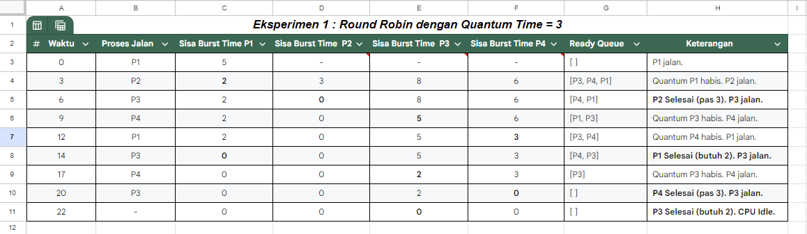
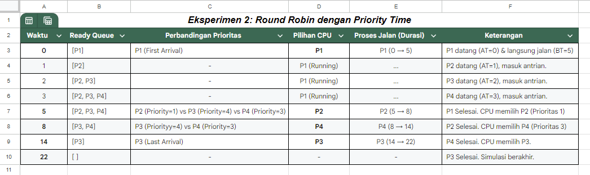
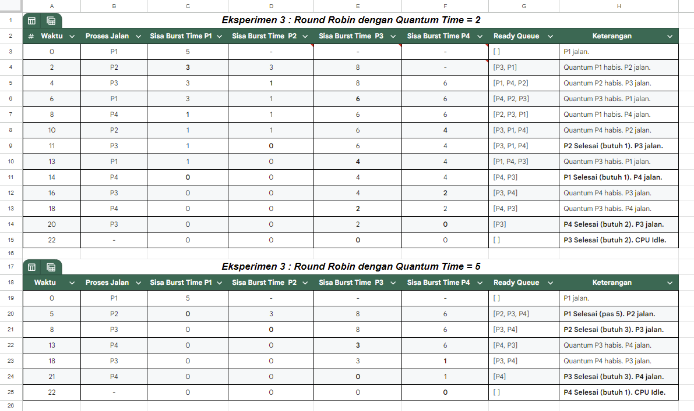
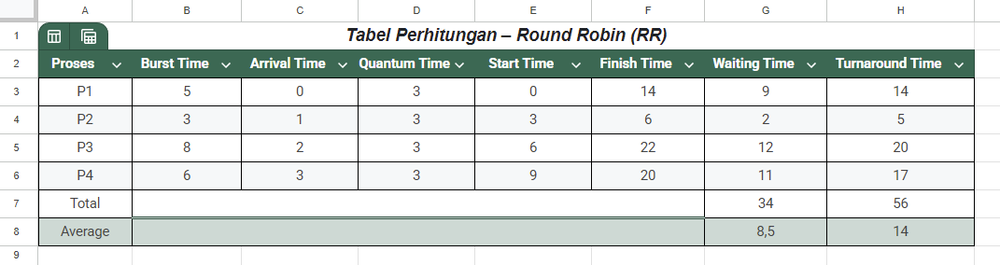
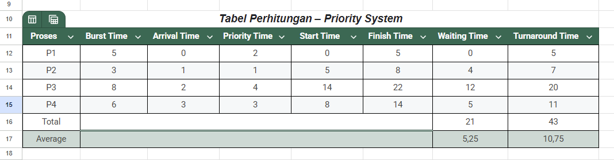

# Laporan Praktikum Minggu 6
Topik: Penjadwalan CPU – Round Robin (RR) dan Priority Scheduling

---

## Identitas
- **Nama** : Prastian Hidayat
- **NIM** : 250202982 
- **Kelas** : 1IKRB

---

## Tujuan
1. Mahasiswa mampu menghitung *waiting time* dan *turnaround time* pada algoritma RR dan Priority.

2. Mahasiswa mampu menyusun tabel hasil perhitungan dengan benar dan sistematis.

3. Mahasiswa mampu membandingkan performa algoritma RR dan Priority.

4. Mahasiswa mampu menjelaskan pengaruh time quantum dan prioritas terhadap keadilan eksekusi proses.

---

## Dasar Teori
* **Penjadwalan CPU** adalah proses pemilihan proses dari *ready queue* (antrian siap) untuk dieksekusi oleh CPU. Tujuannya adalah untuk memaksimalkan utilitas CPU dan meminimalkan waktu tunggu.

* **Round Robin (RR)** adalah algoritma yang dirancang khusus untuk sistem *time-sharing*. RR bersifat *preemptive*, artinya ia tidak menunggu proses selesai. Setiap proses mendapat jatah waktu CPU yang disebut *time quantum* (q), biasanya antara 10-100 milidetik. Jika proses belum selesai dalam satu quantum, ia akan dihentikan sementara (preempted) dan dipindahkan ke akhir antrian 'ready' untuk menunggu giliran berikutnya. Ini memastikan semua proses mendapatkan respons dalam interval waktu yang terdefinisi.

* **Priority Scheduling** adalah algoritma yang dirancang untuk mengalokasikan CPU ke proses dengan prioritas tertinggi. Prioritas dapat ditentukan secara internal (misalnya, batas memori, rasio I/O) atau eksternal (misalnya, kepentingan komersial, kebijakan). Algoritma ini bisa bersifat *preemptive* (proses baru berprioritas tinggi bisa langsung merebut CPU) atau *non-preemptive* (proses baru menunggu CPU dilepaskan). Kelemahan utamanya adalah potensi *starvation*, di mana proses berprioritas rendah mungkin tidak akan pernah dieksekusi.

---

## Langkah Praktikum
Langkah-langkah pengerjaan praktikum Minggu 6 adalah sebagai berikut:
1.  Menyiapkan data proses yang mencakup Burst Time, Arrival Time, dan (untuk Priority Scheduling) nilai Prioritas.
2.  Melakukan **Eksperimen 1 (Round Robin)** dengan *time quantum* (q) = 3. Ini melibatkan pembuatan Gantt Chart, pelacakan sisa *burst time* per putaran, dan perhitungan WT serta TAT.
3.  Melakukan **Eksperimen 2 (Priority Scheduling Non-Preemptive)**. Proses diurutkan dan dieksekusi berdasarkan prioritas tertinggi (nilai angka terkecil) yang telah tiba di antrian.
4.  Melakukan simulasi **Eksperimen 3 (Analisis Quantum)** dengan mengubah time quantum RR menjadi (q) = 2 dan (q) = 5 .
5.  Menganalisis hasil dari kedua eksperimen dan menyajikannya dalam tabel perbandingan untuk mengevaluasi kelebihan serta kekurangan masing-masing.
6.  Mendokumentasikan seluruh hasil perhitungan, ***Gantt Chart*** (bisa dalam bentuk tabel atau gambar) untuk di analisis.
7.  Melakukan *commit* dan *push* laporan akhir ke repositori GitHub dengan pesan commit yang sesuai.
    ```bash
    git add .
    git commit -m "Minggu 6 - CPU Scheduling RR & Priority"
    git push origin main
    ```

---

## Kode / Perintah

```bash
Waiting Time (WT) = Turnaround Time - Burst Time
(Untuk RR, WT adalah Total Waktu Tunggu selama proses dieksekusi)
Turnaround Time (TAT) = Finish Time - Arrival Time
Average Waiting Time (AWT) = Total Waiting Time / Jumlah Proses
Average Turnaround Time (ATAT) = Total Turnaround Time / Jumlah Proses
```
---

## Hasil Eksekusi

### Eksperimen 1 – Round Robin (RR)
1. Di Ketahui quantum (q) = 3. Maka artinya Proses P1 - P4 akan diproses secara bergantian dengan waktu 3 process berdasarkan Antrian ( *Arrival Time* ) dan Antrian Siap ( *Ready Queue* )
2. Simulasikan Waktu Dengan q = 3 maka hasilnya seperti ini
   
   

3. Dengan demikian `Gantt Chart` akan dihasilkan seperti ini
   ```
   | P1 | P2 | P3 | P4 | P1 | P3 | P4 | P3 |
   0    3    6    9   12   14   17   20   22
   ```

---

### Eksperimen 2 – Priority Scheduling (Non-Preemptive)
1. Eksperimen 2 menggunakan sistem prioritas dimana P1 = 2 , P2 = 1 , P3 = 4 , P3 = 3
2. Simulasikan Waktu Proses hingga menghasilkan seperti ini

   

1. Dengan demikian `Gantt Chart` akan dihasilkan seperti ini
   ```
   | P1 | P2 | P4 | P3 |
   0    5    8   14   22
   ```
---

### Eksperimen 3 – Analisis Variasi Time Quantum 
1. Eksperimen 3 ini Menggunakan sistem Round Robin (RR) Dengan q = 2 dan q = 5 
2. Berikut Tabel Simulasi Waktu

   

3. Dengan demikian `Gantt Chart` akan dihasilkan seperti ini

- Quantum = 2
   ```
   | P1 | P2 | P3 | P1 | P4 | P2 | P3 | P1 | P4 | P3 | P4 | P3 |
   0    2    4    6    8   10   11   13   14   16   18   20   22
   ```

- Quantum = 5
   ```
   | P1 | P2 | P3 | P4 | P3 | P4 |
   0    5    8   13   18   21   22
   ```
---

### Eksperimen 4 – Perbandingan
- Rumus 
   ```
   Turnaround Time (TAT) = Waktu Selesai - Waktu Datang (AT)

   Waiting Time (WT) = Turnaround Time - Burst Time (BT) (Atau bisa juga: WT = Waktu Mulai - Waktu Datang)
   ```

- Tabel Perhitungan - Eksperimen 1 dengan Quantum  = 3
  
   

- Tabel Perhitungan - Eksperimen 2 dengan Priority Scheduling
  
   

- Maka Perbandingan didapat

   | Algoritma | Avg Waiting Time | Avg Turnaround Time | Kelebihan | Kekurangan |
   | --- | :--- | :--- | :--- | :--- |
   | RR | 8.50 | 14 | Adil terhadap semua proses | Tidak efisien jika quantum tidak tepat |
   | Priority | 5.25 | 10.75 | Efisien untuk proses penting | Potensi *starvation* pada prioritas rendah |

---

## Analisis
Algoritma *Priority Scheduling (Non-Preemptive)* secara rerata menghasilkan kinerja paling efisien, dengan *Average Waiting Time* (AWT) 5.25 dan *Average Turnaround Time* (ATAT) 10.75. Kinerja ini secara signifikan melampaui algoritma **Round Robin (RR)** pada semua variasi quantum yang diuji (AWT 8.5 untuk q=3, AWT 9.75 untuk q=2, dan AWT 7.0 untuk q=5).

Namun, keunggulan performa rata-rata pada **Priority Scheduling** tersebut harus dibayar dengan dua konsekuensi negatif. Pertama, sifat non-preemptive menyebabkan proses berprioritas tertinggi (P2, Priority 1) yang tiba pada T=1, tetap harus menunggu proses P1 (Priority 2) yang sedang berjalan untuk selesai. Kedua, dan yang paling krusial, algoritma ini mengekspos risiko starvation (kelaparan proses). Proses P3, yang memiliki prioritas terendah (Priority 4), mengalami penundaan eksekusi ekstrem (WT=12), karena baru dapat dieksekusi pada T=14 setelah semua proses lain selesai.

Sebaliknya, algoritma **Round Robin** menunjukkan keunggulan fundamental dalam aspek keadilan (*fairness*). Meskipun rerata waktu tunggunya lebih tinggi, RR menjamin tidak ada proses yang mengalami *starvation*. Pada kasus P3 (q=3), proses tersebut tetap mendapatkan giliran eksekusi pertamanya pada T=6, menunjukkan responsivitas sistem yang lebih baik dibandingkan Priority.

Investigasi lebih lanjut terhadap algoritma Round Robin (Eksperimen 3) menunjukkan sensitivitas performa yang tinggi terhadap parameter time quantum (q):

   * Quantum Terlalu Kecil (q) = 2 : Menghasilkan AWT terburuk (9.75). Hal ini disebabkan oleh frekuensi pergantian proses (context switch) yang terlalu tinggi (12 kali). Setiap pergantian menimbulkan overhead komputasi, sehingga menurunkan efisiensi sistem secara keseluruhan.

   * Quantum Terlalu Besar (q) = 5 : Menghasilkan AWT rata-rata terbaik (7.0). Akan tetapi, hasil ini menipu (deceiving). Dengan quantum yang besar, algoritma RR kehilangan karakteristiknya dan mengalami degenerasi, berperilaku menyerupai algoritma **First Come First Serve** (FCFS). Proses yang datang belakangan (P4) menderita waktu tunggu sangat lama (WT=13) karena harus menunggu proses panjang (P3) menghabiskan jatah quantum-nya yang besar, sehingga mengorbankan aspek keadilan dan responsivitas.

   * Quantum Moderat (q) = 3 : Nilai AWT 8.5 merepresentasikan titik kompromi yang seimbang antara efisiensi (menghindari overhead berlebih) dan keadilan (mencegah degenerasi FCFS).

## Kesimpulan

1. Algoritma **Priority Scheduling** menawarkan throughput dan efisiensi rata-rata (AWT 5.25) yang superior dibandingkan Round Robin, namun keunggulannya diimbangi oleh risiko starvation yang signifikan terhadap proses berprioritas rendah.

2. Algoritma **Round Robin** menjamin keadilan (*fairness*) dan responsivitas yang lebih baik, memastikan setiap proses mendapatkan alokasi CPU tanpa penundaan indefinit, meskipun dengan mengorbankan efisiensi rata-rata.

3. Kinerja algoritma Round Robin sangat bergantung pada pemilihan time quantum. Nilai quantum yang tidak tepat—baik terlampau kecil (q=2) maupun terlampau besar (q=5)—akan menurunkan performa sistem, baik melalui peningkatan overhead komputasi ataupun hilangnya jaminan responsivitas.
---

## Quiz
1. Apa perbedaan utama antara **Round Robin** dan **Priority Scheduling** ?

   **Jawaban:** 
  
   **Round Robin** adalah algoritma preemptive yang mengambil keputusan berdasarkan kuantum waktu (time quantum), ia fokus pada keadilan dan pembagian waktu yang merata. **Priority Scheduling** mengambil keputusan berdasarkan nilai prioritas proses, ia fokus pada penyelesaian tugas-tugas yang dianggap lebih penting terlebih dahulu, dan bisa bersifat preemptive maupun non-preemptive.

2. Apa pengaruh besar/kecilnya *time quantum* terhadap performa sistem (pada RR) ?

   **Jawaban:** 
   
   Ukuran kuantum waktu sangat krusial. Jika time quantum terlalu besar, performa RR akan mendekati FCFS (*First Come First Served*), karena setiap proses kemungkinan besar akan selesai sebelum kuantumnya habis. Jika time quantum terlalu kecil, overhead akibat *context switching* (proses menyimpan status dan memuat status proses baru) akan menjadi sangat tinggi, sehingga CPU lebih banyak menghabiskan waktu untuk berganti proses daripada untuk bekerja (eksekusi), yang menurunkan efisiensi sistem secara drastis.

3. Mengapa algoritma Priority dapat menyebabkan *starvation* ?

   **Jawaban:** 
   
   *Starvation* dapat terjadi jika sistem terus-menerus menerima aliran proses-proses baru dengan prioritas tinggi. Akibatnya, proses-proses yang sudah lama menunggu di antrian tetapi memiliki prioritas rendah mungkin tidak akan pernah mendapat giliran untuk dieksekusi oleh CPU, karena mereka selalu `kalah` oleh proses-proses baru yang lebih penting. 

---

## Refleksi Diri
Tuliskan secara singkat:
- Apa bagian yang paling menantang minggu ini?  
- Bagaimana cara Anda mengatasinya?  

---

**Credit:**  
_Template laporan praktikum Sistem Operasi (SO-202501) – Universitas Putra Bangsa_
