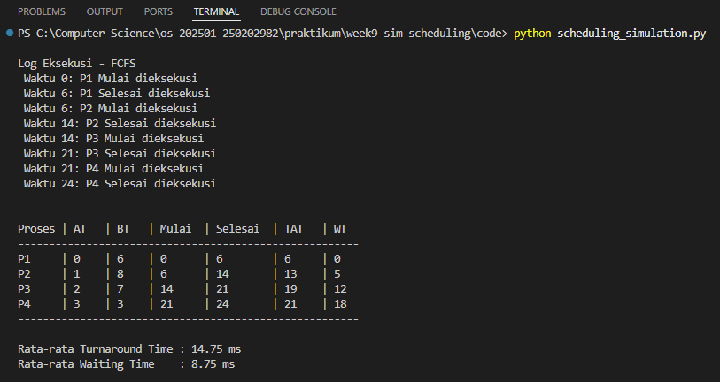

# Laporan Praktikum Minggu 9
Topik: Simulasi Algoritma Penjadwalan CPU (FCFS)

---

## Identitas
- **Nama**  : Prastian Hidayat
- **NIM**   : 250202982
- **Kelas** : 1IKRB
---

## Tujuan
1. Mengimplementasikan algoritma penjadwalan FCFS (*First-Come First-Served*) menggunakan bahasa Python.
2. Memahami alur perhitungan *Waiting Time* dan *Turnaround Time* melalui simulasi program.
3. Menyajikan hasil eksekusi dataset proses dalam bentuk tabel.

---

## Dasar Teori
Penjadwalan CPU (CPU Scheduling) adalah mekanisme sistem operasi untuk mengatur penggunaan CPU oleh berbagai proses. Salah satu algoritma yang paling dasar adalah **FCFS (First-Come First-Served)**.

Prinsip kerja FCFS:
1.  **Antrian FIFO:** Proses yang tiba lebih awal di *ready queue* akan dilayani terlebih dahulu oleh CPU.
2.  **Non-Preemptive:** Sekali CPU digunakan oleh sebuah proses, proses tersebut tidak bisa diganggu hingga selesai (*burst time* habis).
3.  **Kelemahan:** Dapat menyebabkan *Convoy Effect*, di mana proses kecil harus menunggu lama di belakang proses besar.

Rumus Dasar:
- **Turnaround Time (TAT)** = Waktu Selesai (CT) - Waktu Datang (AT)
- **Waiting Time (WT)** = Turnaround Time (TAT) - Burst Time (BT)

---

## Langkah Praktikum
1.  Menyiapkan folder kerja `praktikum/week9-sim-scheduling/`.
2.  Membuat file `dataset.csv` yang berisi daftar proses (P1, P2, P3, P4) lengkap dengan *Arrival Time* dan *Burst Time*.
3.  Membuat program Python sederhana yang membaca file CSV, mengurutkan data berdasarkan waktu kedatangan, dan menghitung waktu tunggu secara berurutan.
4.  Menjalankan program di terminal dan membandingkan hasilnya dengan hitungan manual.
5.  Mendokumentasikan seluruh hasil simulasi, perhitungan, dan analisis dalam file laporan.md.

6. Melakukan commit dan push hasil praktikum ke repositori GitHub.
   ```bash
   git add .
   git commit -m "Minggu 9 - Simulasi Scheduling CPU"
   git push origin main
   ```

---

## Kode / Perintah
Berikut adalah potongan logika utama algoritma FCFS yang saya buat:

```python
# 2. Simulasi 
print("\nLog Eksekusi - FCFS ")
waktu_sekarang = 0

for p in proses_list:
    if waktu_sekarang < p['at']:
        print(f" Waktu {waktu_sekarang} - {p['at']}: CPU Idle (Menunggu proses datang)")
        waktu_sekarang = p['at']

    p['start'] = waktu_sekarang
    print(f" Waktu {p['start']}: {p['id']} Mulai dieksekusi")
    
    # Proses berjalan... (waktu bertambah sesuai Burst Time)
    waktu_sekarang += p['bt']
    
    p['finish'] = waktu_sekarang
    print(f" Waktu {p['finish']}: {p['id']} Selesai dieksekusi")
    
    p['tat'] = p['finish'] - p['at']
    p['wt'] = p['tat'] - p['bt']
```

Perintah eksekusi:
```
python code/scheduling_simulation.py
```

---

## Hasil Eksekusi
Berikut adalah output program saat dijalankan dengan dataset uji:


---

## Analisis
Berdasarkan hasil eksekusi program simulasi algoritma First-Come First-Served (FCFS) menggunakan dataset uji, berikut adalah analisis mendalam mengenai jalannya proses dan kinerja algoritma:

1. Alur Eksekusi Program

    Program membaca dataset yang berisi 4 proses (P1, P2, P3, P4) dan mengurutkannya berdasarkan Arrival Time (Waktu Datang). Simulasi berjalan dengan urutan sebagai berikut:

   * P1 (Datang t=0, Burst=6): Karena P1 datang pertama saat CPU kosong, P1 langsung dieksekusi dari t=0 hingga t=6. Waiting Time P1 adalah 0 ms.

   * P2 (Datang t=1, Burst=8): P2 tiba saat P1 sedang berjalan. P2 harus menunggu di ready queue hingga P1 selesai pada t=6. P2 kemudian dieksekusi dari t=6 hingga t=14.

   * P3 (Datang t=2, Burst=7): P3 tiba saat CPU masih sibuk memproses P1 (dan antrian P2). P3 baru bisa dieksekusi setelah P2 selesai pada t=14. P3 berjalan hingga t=21.

   * P4 (Datang t=3, Burst=3): P4 adalah proses paling singkat, namun karena datang terakhir dan menggunakan prinsip FCFS (antrian), P4 harus menunggu semua proses sebelumnya selesai. P4 baru berjalan pada t=21 dan selesai pada t=24.

1. Validasi dengan Perhitungan Manual

    Hasil output program menunjukkan:

        Rata-rata Turnaround Time (TAT): 14.75 ms

        Rata-rata Waiting Time (WT): 8.75 ms

    Hasil ini konsisten dan akurat jika dibandingkan dengan perhitungan manual yang dilakukan pada modul praktikum minggu sebelumnya. Hal ini membuktikan bahwa logika kode program (pengurutan berdasarkan arrival time dan akumulasi waktu) telah diimplementasikan dengan benar.

2. Fenomena Convoy Effect
   
    Hasil simulasi memperlihatkan kelemahan utama algoritma FCFS, yaitu fenomena Convoy Effect. Hal ini terlihat jelas pada proses P4:

    P4 memiliki Burst Time sangat kecil (hanya 3 ms).

    Namun, P4 memiliki Waiting Time yang sangat besar (18 ms) karena terjebak di belakang proses-proses panjang (P2 dan P3).

    Hal ini menurunkan efisiensi sistem secara keseluruhan karena proses singkat dipaksa menunggu lama.

3. Kelebihan dan Keterbatasan Simulasi
   
    * Kelebihan: Simulasi menggunakan program memungkinkan pengujian dataset dalam jumlah besar secara instan dan meminimalisir kesalahan aritmatika yang sering terjadi pada perhitungan manual.

    * Keterbatasan: Program simulasi ini mengasumsikan kondisi ideal di mana waktu untuk context switching (perpindahan antar proses) adalah 0 ms. Pada sistem operasi nyata, perpindahan proses membutuhkan waktu overhead yang akan sedikit menambah Turnaround Time.

---

## Kesimpulan
- Pembuatan simulasi FCFS cukup sederhana karena hanya membutuhkan pengurutan data berdasarkan waktu datang (sort by Arrival Time).

- Program komputer sangat membantu menghitung rata-rata waktu tunggu tanpa kesalahan hitung manual.

- Algoritma FCFS adil dari segi antrian, tapi tidak efisien untuk proses singkat yang datang belakangan.

---

## Quiz
1. **Mengapa simulasi diperlukan untuk menguji algoritma scheduling?**
   
   **Jawaban:**
   
    Untuk memastikan logika algoritma benar dan mengetahui performa (waktu tunggu) secara cepat tanpa harus menghitung manual satu per satu, apalagi jika datanya banyak.

2. **Apa perbedaan hasil simulasi dengan perhitungan manual jika dataset besar?** 
   
   **Jawaban:**
   
   Hasil angkanya harusnya sama. Bedanya, simulasi komputer jauh lebih cepat dan akurat (_minim human error_), sedangkan hitungan manual di kertas rawan salah tambah/kurang.

3. **Algoritma mana yang lebih mudah diimplementasikan? Jelaskan.** 
   
   **Jawaban:** 
   
   FCFS lebih mudah. Logikanya hanya "siapa cepat dia dapat" (antrian biasa/FIFO), jadi cukup pakai looping sederhana. Tidak perlu mencari nilai terkecil setiap saat seperti algoritma SJF.

---

## Refleksi Diri

**Tantangan:** Awalnya saya bingung bagaimana cara membaca file CSV di Python.

**Solusi:** Saya mempelajari modul csv di Python dan menggunakan csv.DictReader yang ternyata memudahkan pengambilan data per kolom.

---

**Credit:**  
_Template laporan praktikum Sistem Operasi (SO-202501) – Universitas Putra Bangsa_